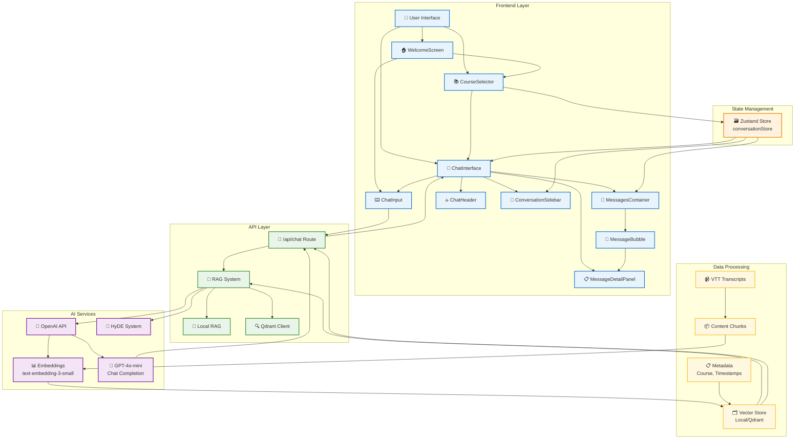
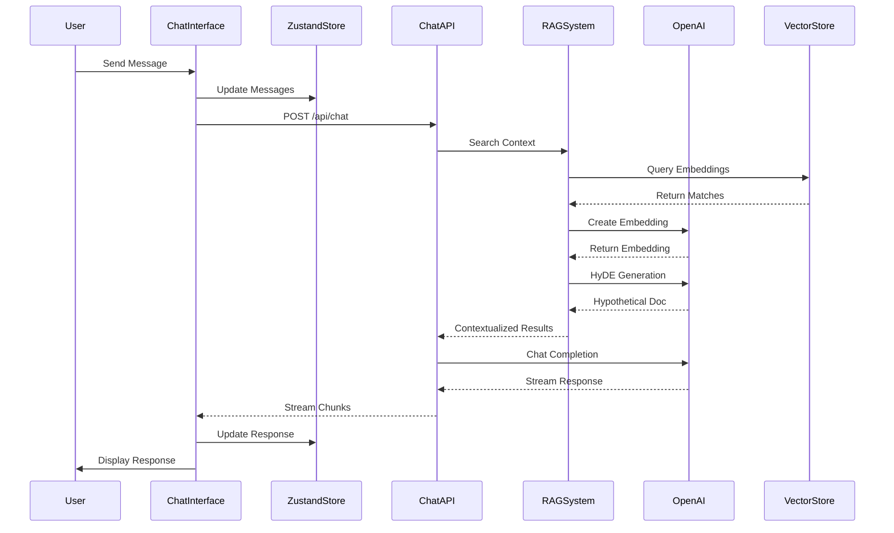

# FlowMind Architecture Flow Diagram

## Architecture Components

### 🎨 Frontend Layer

- **ChatInterface**: Main orchestrator component
- **WelcomeScreen**: Initial user onboarding
- **CourseSelector**: Course selection interface
- **MessagesContainer**: Chat message display
- **MessageBubble**: Individual message rendering
- **MessageDetailPanel**: Expandable message details
- **ChatInput**: User input handling
- **ChatHeader**: Navigation and branding
- **ConversationSidebar**: Conversation management

### 🗃️ State Management

- **Zustand Store**: Centralized conversation state
  - Current conversation tracking
  - Message history management
  - Course selection persistence
  - UI state coordination

### 🔌 API Layer

- **Chat Route**: Streaming chat API endpoint
- **RAG System**: Retrieval-augmented generation
- **Local RAG**: Fallback vector search
- **Qdrant Client**: Vector database integration

### 🤖 AI Services

- **OpenAI API**: Primary AI service provider
- **Embeddings**: Text-to-vector conversion
- **GPT-4o-mini**: Chat completion generation
- **HyDE System**: Hypothetical document embeddings

### 💾 Data Processing

- **VTT Transcripts**: Course content source
- **Content Chunks**: Processed text segments
- **Vector Store**: Embedded content storage
- **Metadata**: Course and timestamp information

## Data Flow Sequence

## Component Interactions

### 🔄 State Flow

1. **Course Selection** → ZustandStore → ChatInterface
2. **Message Creation** → ZustandStore → MessagesContainer
3. **Conversation Management** → ZustandStore → ConversationSidebar

### 🚀 Request Flow

1. **User Input** → ChatInput → ChatInterface
2. **API Call** → Chat Route → RAG System
3. **Context Retrieval** → Vector Store → OpenAI
4. **Response Generation** → Streaming → UI Update

### 📊 Data Processing Flow

1. **VTT Files** → Content Chunking → Embedding Generation
2. **Vector Storage** → Semantic Search → Context Retrieval
3. **HyDE Enhancement** → Query Expansion → Better Matching

## Key Features

### 🎯 Smart Context Retrieval

- Semantic search with cosine similarity
- HyDE for query enhancement
- Multi-perspective query rewriting
- Relevance scoring and filtering

### 💫 Real-time UI

- Streaming response rendering
- Animated typing indicators
- Smooth transitions with Framer Motion
- Responsive two-column layout

### 🧠 Advanced AI Integration

- GPT-4o-mini for chat completions
- text-embedding-3-small for vectors
- Custom system prompts
- Source attribution with timestamps

### 📱 Modern UX

- Course-specific conversations
- Expandable message details
- Markdown export functionality
- Smart panel visibility controls
