# Clerk Authentication Redirect Issue - Root Cause Analysis

## 🐛 Problem Description

Users were getting **stuck on the landing page** after successful authentication with Clerk, instead of being redirected to the `/chat` page. This created a frustrating user experience where authentication succeeded but users couldn't access the protected content.

## 🔍 Root Cause Analysis

### Primary Issues Identified:

#### 1. **Conflicting Redirect Mechanisms** 
```typescript
// ❌ PROBLEM: Multiple redirect strategies fighting each other

// Landing page components had redirect props:
<SignUpButton 
  afterSignUpUrl="/chat"     // Clerk component prop
  redirectUrl="/chat"        // Another Clerk prop
>

// PLUS server-side redirect in home page:
export default async function Home() {
  const { userId } = await auth();
  if (userId) {
    redirect('/chat');  // Next.js server redirect
  }
}

// PLUS middleware redirect:
if (userId && req.nextUrl.pathname === '/') {
  return Response.redirect(new URL('/chat', req.url))  // Middleware redirect
}
```

**Result**: Multiple redirect mechanisms caused race conditions and circular redirects.

#### 2. **Modal Authentication Flow Issues**
```typescript
// ❌ PROBLEM: Modal authentication vs page-based navigation
<SignInButton mode='modal'>  // Opens in modal overlay
```

When using `mode='modal'`, Clerk opens authentication in an overlay on the current page. After successful authentication:
- Modal closes
- User remains on the same page (landing page)
- Redirect props (`afterSignInUrl`, `redirectUrl`) were being ignored or conflicting

#### 3. **Client vs Server Hydration Conflicts**
```typescript
// ❌ PROBLEM: Server-side redirect conflicts with client-side state
// Server renders one state, client hydrates with different auth state
export default async function Home() {
  const { userId } = await auth();  // Server-side check
  if (userId) redirect('/chat');
  // But client-side Clerk might still be loading auth state
}
```

**Result**: Hydration mismatches and inconsistent redirect behavior.

#### 4. **Clerk Configuration Missing Environment Variables**
```env
# ❌ MISSING: No global redirect configuration
# These environment variables weren't set:
NEXT_PUBLIC_CLERK_AFTER_SIGN_IN_URL=/chat
NEXT_PUBLIC_CLERK_AFTER_SIGN_UP_URL=/chat
```

Without these, Clerk defaults to staying on the current page after authentication.

## 🚧 Specific Code Issues

### Issue 1: Duplicate Configuration
```typescript
// src/components/landing/RefreshingLandingPage.tsx
const clerkAppearance = {
  elements: {
    headerSubtitle: 'text-gray-500 font-medium',  // ❌ First definition
    // ... other styles
    headerSubtitle: 'hidden',  // ❌ Duplicate! Second definition overwrites first
  }
}
```

### Issue 2: Middleware Async/Await Problems
```typescript
// middleware.ts
export default clerkMiddleware(async (auth, req) => {
  if (isProtectedRoute(req)) {
    await auth().protect()  // ❌ TypeScript error: protect() doesn't exist on Promise
  }
})
```

### Issue 3: Component Prop Conflicts
```typescript
// Multiple redirect props causing conflicts
<SignUpButton 
  mode='modal'
  afterSignUpUrl="/chat"    // ❌ Conflicts with modal mode
  redirectUrl="/chat"       // ❌ Redundant, causes confusion
>
```

## ✅ Solutions Implemented

### Solution 1: Environment Variable Configuration (Primary Fix)
```env
# .env.local - Global Clerk configuration
NEXT_PUBLIC_CLERK_AFTER_SIGN_IN_URL=/chat
NEXT_PUBLIC_CLERK_AFTER_SIGN_UP_URL=/chat
NEXT_PUBLIC_CLERK_SIGN_IN_URL=/sign-in  
NEXT_PUBLIC_CLERK_SIGN_UP_URL=/sign-up
```

**Why this works**: 
- ✅ Clerk natively handles redirects using these environment variables
- ✅ Works consistently across all authentication flows
- ✅ No race conditions or conflicts with other redirect mechanisms

### Solution 2: Enhanced Middleware
```typescript
// middleware.ts - Clean, focused approach
export default clerkMiddleware(async (auth, req) => {
  // Protect chat routes
  if (isProtectedRoute(req)) {
    const { userId } = await auth()
    if (!userId) {
      return Response.redirect(new URL('/sign-in', req.url))
    }
  }
  
  // Redirect authenticated users away from landing page
  if (isPublicRoute(req)) {
    const { userId } = await auth()
    if (userId) {
      return Response.redirect(new URL('/chat', req.url))
    }
  }
})
```

### Solution 3: Dedicated Auth Pages
```typescript
// src/app/sign-in/[[...sign-in]]/page.tsx
<SignIn 
  afterSignInUrl="/chat"
  redirectUrl="/chat"
  appearance={customAppearance}
/>
```

**Benefits**:
- ✅ Professional dedicated authentication pages
- ✅ Proper redirect props work correctly in page context
- ✅ Better UX than modal overlays for primary auth flows

### Solution 4: Clean Component Props
```typescript
// Removed conflicting props from landing page components
<SignInButton 
  mode='modal'
  appearance={clerkAppearance}
  // ✅ No redirect props - handled by environment variables
>
```

## 📊 Issue Priority Matrix

| Issue | Impact | Frequency | Fix Complexity |
|-------|--------|-----------|----------------|
| Environment variables missing | 🔴 High | 🔴 Always | 🟢 Low |
| Modal redirect conflicts | 🔴 High | 🟡 Common | 🟡 Medium |
| Multiple redirect mechanisms | 🟡 Medium | 🟡 Common | 🔴 High |
| Middleware TypeScript errors | 🟡 Medium | 🔴 Always | 🟢 Low |

## 🧪 Testing the Fix

### Test Cases to Verify:
1. **Fresh user signup** → Should redirect to `/chat`
2. **Returning user signin** → Should redirect to `/chat` 
3. **Direct `/` access when authenticated** → Should redirect to `/chat`
4. **Direct `/chat` access when not authenticated** → Should redirect to `/sign-in`

### Expected Behavior:
```
Unauthenticated user visits "/" → Sees landing page
User clicks "Sign Up" → Goes to "/sign-up" page
User completes signup → Automatically redirected to "/chat"
User visits "/" while authenticated → Automatically redirected to "/chat"
```

## 🔄 Migration Path

### Before (Problematic):

```mermaid
graph TD
    A[User on Landing Page] --> B[Clicks Sign In Modal]
    B --> C[Modal Opens on Same Page]
    C --> D[User Authenticates]
    D --> E[Modal Closes]
    E --> F[User Still on Landing Page 😢]
    F --> G[Multiple Redirects Fight]
    G --> H[User Gets Stuck]
```


### After (Fixed):

```mermaid
graph TD
    A[User on Landing Page] --> B[Clicks Sign In]
    B --> C[Navigates to /sign-in]
    C --> D[User Authenticates]
    D --> E[Environment Variable Triggers]
    E --> F[Clean Redirect to /chat 🎉]
```


## 📝 Key Learnings

1. **Use Clerk's Native Systems**: Environment variables are more reliable than component props
2. **Avoid Competing Redirects**: Don't mix server-side, client-side, and Clerk redirects  
3. **Modal vs Page Authentication**: Pages provide better redirect control
4. **Middleware Simplicity**: Keep middleware focused on protection, not complex redirects

## 🎯 Future Recommendations

1. **Always test authentication flows** in both development and production
2. **Use environment variables** for global Clerk configuration 
3. **Prefer dedicated auth pages** over modal authentication for primary flows
4. **Keep redirect logic centralized** - avoid spreading it across multiple files
5. **Monitor for TypeScript errors** in middleware and authentication code

---

*This analysis documents the complete resolution of the "stuck on landing page after authentication" issue in the FlowMind application.*