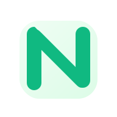

<div align="center">
  
  <h1>Neruvi ✨</h1>
  <p><em>Your AI Learning Navigator</em></p>
</div>

## Overview

**Neruvi** is an advanced AI-powered learning assistant that helps you master **Node.js** and **Python** with precision. Using **RAG (Retrieval-Augmented Generation)** technology, Neruvi provides accurate answers exclusively from curated course transcripts—no web searches, just verified educational content.

## Key Features

✅ **RAG-Powered Responses** - Answers from 61+ processed course transcript chunks
✅ **Real-time Streaming Chat** - Microsoft Copilot/Claude-style interface
✅ **Conversation Threading** - Branch and trace conversation paths
✅ **Source References** - Timestamp-linked course materials
✅ **Role-Based Access** - User/Moderator/Admin permissions
✅ **Course Organization** - Node.js & Python content management
✅ **Memory Integration** - Mem0 AI ready for personalized learning

## Tech Stack

   

- **Framework:** Next.js 15 with TypeScript
- **AI Models:** OpenAI GPT-4o-mini + text-embedding-3-small
- **Styling:** Tailwind CSS with Figtree typography
- **Database:** PostgreSQL (NeonDB)
- **Auth:** Clerk authentication
- **Animations:** Framer Motion + GSAP

## Quick Start

```bash
# Clone and install
git clone <repository>
cd flowmind
npm install

# Setup environment
cp .env.example .env.local
# Add your OPENAI_API_KEY

# Start development
npm run dev
# Visit: http://localhost:3000
```

## Architecture

Neruvi uses a **data-only approach**—responses come exclusively from processed course transcripts, ensuring:
- **Accuracy:** Verified course content only
- **Relevance:** Curriculum-aligned answers
- **Traceability:** Timestamp references to source materials

```
User Query → RAG System → Vector Search → Course Transcripts → AI Synthesis → Response
```

## Project Structure

```
flowmind/
├── src/
│   ├── app/                 # Next.js app routes
│   ├── components/          # React components
│   ├── lib/                 # RAG system & utilities
│   ├── data/transcripts/    # Course content (61+ chunks)
│   └── stores/              # State management
├── docs/                    # Documentation
└── public/                  # Static assets
```

## Available Commands

```bash
npm run dev              # Development server
npm run build            # Production build
npm run test-rag         # Test RAG pipeline
npm run debug-rag        # Debug RAG processing
```

## Documentation

- **[Full README](./README.md)** - Comprehensive project documentation
- **[Mem0 Integration](./docs/MEM0_INTEGRATION.md)** - Personalized learning memory
- **[Architecture](./docs/ARCHITECTURE.md)** - System design details
- **[Docs Hub](./docs/README.md)** - Complete documentation index

## Environment Variables

```env
# Required
OPENAI_API_KEY=sk-proj-your-key

# Authentication
NEXT_PUBLIC_CLERK_PUBLISHABLE_KEY=pk_test_...
CLERK_SECRET_KEY=sk_test_...

# Database
DATABASE_URL=postgresql://...
```

## Performance

| Metric | Value |
|--------|-------|
| Content Chunks | 61 (Node.js + Python) |
| Search Accuracy | 0.4+ similarity scores |
| Response Time | <2s for semantic search |
| Embedding Model | 1536 dimensions |

## Contributing

1. Fork the repository
2. Create feature branch: `git checkout -b feature/amazing-feature`
3. Test changes: `npm run test-rag`
4. Commit: `git commit -m 'Add amazing feature'`
5. Push: `git push origin feature/amazing-feature`
6. Open Pull Request

## License

MIT License - see [LICENSE](LICENSE) file

---

**Built with ❤️ for enhanced learning through AI**

*Neruvi - Where AI meets education*
