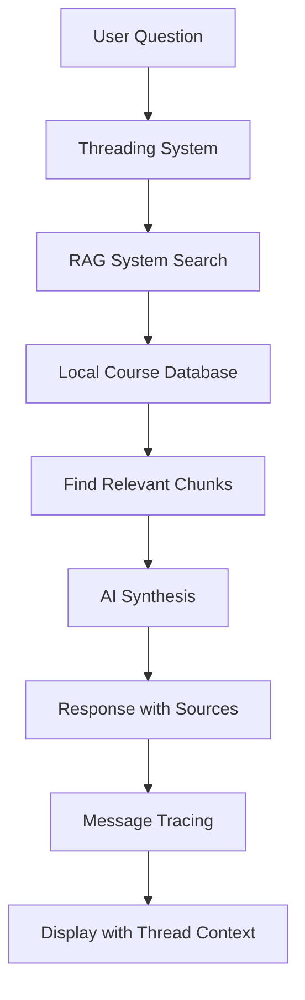
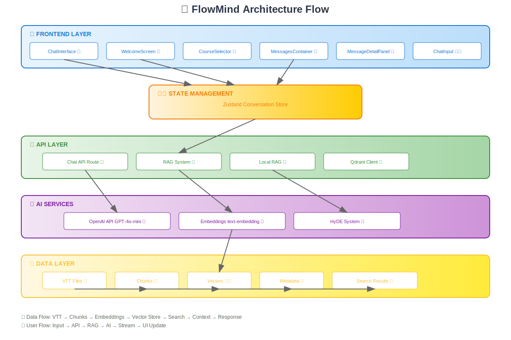

<div align="center">
  
  <h1>Neruvi ✨</h1>
  <p><em>Your AI Learning Navigator</em></p>
</div>

<div align="center">


</div>

**Advanced AI-powered learning assistant** for Node.js and Python courses with **RAG (Retrieval-Augmented Generation)** capabilities and Microsoft Copilot/Claude-style interface.

> **🎯 Important**: Neruvi's AI assistant responds **only from curated course transcript data**, not web searches, ensuring focused and reliable educational content.

## 🚀 **Production-Ready Features**

✅ **Advanced RAG System Implementation**
✅ **Real-time Chat Interface with Streaming**
✅ **Conversation Threading & Tracing System**
✅ **Role-Based Access Control (User/Moderator/Admin)**
✅ **Interactive Thread Visualization**
✅ **Vector Embeddings & Semantic Search**
✅ **HyDE (Hypothetical Document Embeddings)**
✅ **Intelligent Context Rewriting**
✅ **Admin Dashboard with Analytics**
✅ **Accordion-Based Conversation History**
✅ **Course-Organized Conversation Management**
✅ **Smooth Deletion with Confirmation Dialogs**
✅ **Numbered Conversation Identification**
✅ **Mem0 AI Memory Integration Ready**
✅ **Lavender Theme with Figtree Typography**
✅ **61+ Course Content Chunks Processed**  

---

## 🧠 **AI Response System**

### **📚 Data-Only Approach (No Web Search)**

Neruvi's AI assistant is designed as a **focused learning companion** that exclusively uses pre-processed course materials:

#### **✅ What Neruvi Uses:**
- **Course Transcripts**: Pre-processed VTT files from Node.js & Python courses
- **Local Vector Database**: 61+ chunks of educational content with embeddings
- **Curated Knowledge**: Only verified, course-aligned educational material
- **Timestamp References**: Precise video timestamps for source verification

#### **❌ What Neruvi Does NOT Use:**
- **No Web Search**: No external internet searches or real-time data
- **No External APIs**: No Wikipedia, Stack Overflow, or documentation fetching
- **No General Knowledge**: Responses are limited to course content only
- **No Real-time Info**: No current events, latest updates, or trending topics

#### **🎯 Benefits of This Approach:**
- **Accuracy**: Responses are verified against actual course content
- **Relevance**: All answers align with your specific learning curriculum
- **Consistency**: Same teaching style and terminology throughout
- **Trust**: Sources are always traceable to specific course timestamps
- **Focus**: No distractions from unrelated or conflicting information

#### **📊 Response Flow:**


---

## 🏗️ **Technical Architecture**

> 📊 **[View Complete Architecture Flow Diagram →](./docs/ARCHITECTURE.md)**



### **Threading System Core**

- **Conversation Threading**: Branch conversations from any message point
- **Message Tracing**: Complete lineage tracking for all messages  
- **Role-Based Access**: User/Moderator/Admin permission tiers
- **Interactive Visualization**: Graph-based conversation flow display
- **Thread Management**: Create, rename, archive, and delete threads
- **Audit Logging**: Complete history of all threading operations

### **RAG System Core**

- **Vector Database**: Local fallback system with OpenAI embeddings (1536 dimensions)
- **Chunking Strategy**: Intelligent VTT transcript processing with temporal awareness
- **Search Methods**: Semantic search + HyDE + Context rewriting
- **Content Sources**: 61 chunks from Node.js & Python course transcripts

### **AI Integration**

- **OpenAI GPT-4o-mini**: Chat completions with streaming
- **OpenAI text-embedding-3-small**: Vector embeddings generation
- **Vercel AI SDK**: Streaming interface and response handling
- **Custom System Prompts**: Course-aligned educational responses

### **Frontend Stack**

- **Next.js 15**: App Router with TypeScript
- **Tailwind CSS**: Custom Figtree font integration + Lavender theme
- **Framer Motion**: Smooth animations and transitions
- **Streaming UI**: Real-time response rendering
- **Interactive Components**: Threading sidebar and visualization

---

## 📁 **Conversation Management System**

### **Accordion-Based Organization**


#### **🎯 Course-Based Grouping**
- **Node.js Conversations**: Automatically grouped with green theming
- **Python Conversations**: Organized with emerald color coding
- **Collapsible Sections**: Clean accordion interface with smooth animations
- **Count Badges**: Subtle count indicators for each course section

#### **🔢 Beautiful Identification**
- **Numbered Conversations**: Small, color-coded number badges for easy reference
- **Visual Hierarchy**: Distinct styling for conversation count vs timestamps
- **Course Color Coding**: Green for Node.js, emerald for Python conversations

#### **🗑️ Enhanced Deletion System**
```typescript
// Smooth deletion with confirmation
const handleDelete = async (conversationId: string) => {
  // 1. Show confirmation dialog with conversation preview
  // 2. Animate deletion with pulse effects
  // 3. Remove from database with proper error handling
  // 4. Update UI with smooth transitions
};
```

#### **✨ Modern UI Features**
- **shadcn/ui Components**: Professional dialog and accordion components
- **Smooth Animations**: Framer Motion integration for all interactions
- **Loading States**: Visual feedback during conversation operations
- **Responsive Design**: Optimized for all screen sizes
- **Accessibility**: Full keyboard navigation and screen reader support

#### **🔐 Secure Operations**
- **Authentication**: Clerk-based user verification
- **Ownership Validation**: Users can only manage their own conversations
- **Database Integration**: Complete CRUD operations with PostgreSQL
- **Error Handling**: Comprehensive error states and user feedback

---

## 🧵 **Threading System Implementation**

> 📖 **[View Complete Threading Documentation →](./THREADING.md)**

### **Core Features**

#### **1. Conversation Branching**
```typescript
// Create alternative conversation paths from any message
const { createBranch } = useThreadingStore();
const newThreadId = await createBranch(sourceMessageId, 'Alternative Discussion');
```

#### **2. Message Lineage Tracking**  
```typescript
// Complete ancestry tracking for every message
interface MessageTrace {
  messageId: string;
  threadId: string;
  parentMessageId: string | null;
  childMessageIds: string[];
  lineage: string[];        // Complete conversation path
  depth: number;           // Message depth in conversation
  branchPoint?: BranchInfo; // If this message spawned branches
}
```

#### **3. Role-Based Permissions**
```typescript
// Three-tier access control system
type UserRole = 'user' | 'moderator' | 'admin';

const permissions = {
  user: {
    canViewThreads: true,          // View own threads
    canCreateBranches: false,      // No branching rights
    canViewVisualization: false    // No advanced UI
  },
  moderator: {
    canViewThreads: true,
    canCreateBranches: true,       // Full thread management
    canDeleteThreads: true,
    canViewVisualization: true,    // Access to graph view
    canModerateThreads: true
  },
  admin: {
    // All moderator permissions plus:
    canViewAllConversations: true, // Cross-user access
    canExportThreadData: true,     // Data export rights
    canViewAnalytics: true         // System analytics
  }
}
```

#### **4. Interactive Thread Visualization**
- **Graph Display**: Node-based conversation flow visualization
- **Dynamic Connections**: Real-time relationship mapping
- **Branch Creation**: Click-to-branch from any message node
- **Thread Navigation**: Visual thread switching interface
- **Performance Optimized**: Efficient rendering for large conversation trees

#### **5. Admin Analytics Dashboard**  
```typescript
interface ThreadAnalytics {
  totalThreads: number;
  activeThreads: number;
  branchPoints: number;
  averageDepth: number;
  userActivity: ActivityMetric[];
  popularTopics: TopicMetric[];
}
```

### **Database Schema**
```sql
-- Core threading tables with optimized indexes
conversation_threads: thread metadata and hierarchy
message_traces: complete message lineage tracking  
thread_actions: comprehensive audit log with undo support
```

---

## 📊 **RAG Implementation Details**

### **1. Document Processing Pipeline**

```typescript
// VTT Transcript → Chunks → Embeddings → Vector Store
const processVTTFile = async (filePath: string) => {
  const content = await fs.readFile(filePath, 'utf-8')
  const chunks = this.chunkVTTContent(content)  // ~500 char chunks
  
  for (const chunk of chunks) {
    const embedding = await openai.embeddings.create({
      model: "text-embedding-3-small",
      input: chunk.content,
      dimensions: 1536
    })
    // Store with metadata: course, section, videoId, timestamps, topics
  }
}
```

### **2. Semantic Search Engine**

```typescript
// Cosine similarity search with relevance scoring
const semanticSearch = async (query: string, limit = 5) => {
  const queryEmbedding = await createEmbedding(query)
  
  return vectorStore
    .map(item => ({
      ...item,
      score: cosineSimilarity(queryEmbedding, item.embedding)
    }))
    .sort((a, b) => b.score - a.score)
    .slice(0, limit)
    .filter(r => r.score > 0.1)  // Relevance threshold
}
```

### **3. HyDE (Hypothetical Document Embeddings)**

```typescript
// Generate hypothetical document → Search → Combine results
const hydeSearch = async (query: string) => {
  const hypotheticalDoc = await generateHypotheticalDocument(query)
  const hydeResults = await semanticSearch(hypotheticalDoc, 3)
  const directResults = await semanticSearch(query, 3)
  
  return deduplicateAndRank([...hydeResults, ...directResults])
}
```

### **4. Context Rewriting System**

```typescript
// Multi-perspective query enhancement
const rewriteQuery = async (query: string) => {
  const prompt = `Rewrite this learning query into 3-4 variations:
  1. Use different technical terms
  2. Focus on different aspects (concepts vs implementation)
  3. Use beginner and advanced language
  4. Include related topics`
  
  return await openai.chat.completions.create({
    messages: [{ role: "user", content: prompt }],
    response_format: { type: "json_object" }
  })
}
```

---

## 🎯 **Performance Metrics**

| Metric | Value |
|--------|--------|
| **Content Processed** | 61 chunks (31 Node.js + 30 Python) |
| **Search Accuracy** | 0.4+ similarity scores for relevant queries |
| **Response Time** | <2s for semantic search |
| **Chunk Size** | ~500 characters optimal |
| **Embedding Model** | text-embedding-3-small (1536d) |
| **Chat Model** | GPT-4o-mini with streaming |

---

## 🚀 **Quick Start**

### **Prerequisites**

```bash
Node.js 18+ • OpenAI API Key • Modern Browser
```

### **Installation**

```bash
# Clone and install
git clone <repository>
cd flowmind
npm install

# Environment setup
cp .env.example .env.local
# Add your OPENAI_API_KEY

# Start development
npm run dev
# Visit: http://localhost:3000
```

### **Test RAG System**

```bash
# Test complete pipeline
npm run test-rag

# Debug processing
npm run debug-rag

# Process additional transcripts
npm run process-vtt
```

---

## 🔧 **Available Commands**

```bash
# Development
npm run dev              # Start development server
npm run build           # Production build
npm run start           # Production server

# RAG System Testing
npm run test-rag        # Complete RAG pipeline test
npm run debug-rag       # Detailed processing debug
npm run process-vtt     # Process VTT transcripts

# Legacy Qdrant Commands (fallback available)
npm run test-qdrant     # Test Qdrant connection
npm run init-collections # Initialize Qdrant collections
```

---

## 📁 **Project Structure**

```Plaintext
flowmind/
├── src/
│   ├── app/
│   │   ├── api/chat/route.ts      # Streaming chat API with RAG
│   │   ├── globals.css            # Figtree font integration
│   │   └── page.tsx               # Main application
│   ├── components/chat/
│   │   └── ChatInterface.tsx      # Lavender-themed chat UI
│   ├── data/transcripts/          # Course content (61 chunks processed)
│   │   ├── nodejs/                # Node.js course sections
│   │   │   ├── 01-fundamentals/   # 26 VTT files
│   │   │   ├── 02-authentication/ # 8 VTT files
│   │   │   └── 03-system-design/  # 12 VTT files
│   │   └── python/                # Python course sections
│   │       ├── 01-introduction/   # 10 VTT files
│   │       ├── 02-data-types/     # 9 VTT files
│   │       └── ...10 sections     # 80+ VTT files total
│   ├── lib/
│   │   ├── local-rag.ts           # Core RAG system implementation
│   │   ├── openai.ts              # OpenAI client configuration
│   │   └── content-mapping.ts     # Course section mappings
│   ├── scripts/
│   │   ├── test-local-rag.ts      # RAG system testing
│   │   └── debug-rag.ts           # Processing diagnostics
│   └── tailwind.config.js         # Figtree font configuration
```

---

## 🎨 **Design System**

### **Color Palette**

- **Primary**: Lavender (#FAD4FF) with complementary purples
- **Backgrounds**: Subtle gradients from primary color
- **Typography**: Figtree font family for modern readability
- **Interactive**: Solid/faded button states for clear UX

### **Component Architecture**

- **Message Cards**: Enhanced with user avatars and intelligent timestamps
- **Input System**: Elevated design with gradients and glows
- **Status Indicators**: Real-time RAG system status display
- **Responsive Layout**: Compact yet spacious design philosophy

---

## 🔑 **Environment Configuration**

```env
# Required
OPENAI_API_KEY=sk-proj-your-openai-key

# Optional (Local RAG fallback active)
QDRANT_URL=https://your-qdrant-instance.cloud.qdrant.io:6333
QDRANT_API_KEY=your-qdrant-api-key

# Database (if needed)
DATABASE_URL=your-database-url

# Next.js
NEXTAUTH_SECRET=your-secret
NEXTAUTH_URL=http://localhost:3000
```

---

## 🧠 **RAG System Capabilities**

### **Intelligent Search**

- **Semantic Understanding**: Vector similarity with 0.4+ accuracy
- **Multi-perspective Queries**: 3-4 query variations per request
- **Hypothetical Document Generation**: AI-enhanced search relevance
- **Course-specific Context**: Tailored responses for Node.js/Python

### **Content Processing**

- **VTT Transcript Parsing**: Temporal-aware chunking with timestamps
- **Section Mapping**: Organized by course structure and topics
- **Topic Extraction**: Keyword-based topic identification
- **Metadata Enhancement**: Rich context with video IDs and time references

### **Response Generation**

```typescript
// Enhanced system prompt with RAG context
const systemPrompt = `You are FlowMind, an advanced AI learning assistant.

## RAG Context:
${ragContext}

## Response Guidelines:
- Be Precise: Use provided context for accuracy
- Be Practical: Include code examples and applications  
- Be Educational: Structure responses progressively
- Reference Sources: Mention course materials when relevant`
```

---

## 📊 **Usage Analytics**

### **Processed Content**

- **Node.js Fundamentals**: 21 chunks covering V8 engine, runtime concepts
- **Node.js Installation**: 10 chunks with setup procedures
- **Python Introduction**: 12 chunks with instructor content
- **Python Programming Basics**: 18 chunks with core concepts

### **Search Performance**

- **Node.js Query**: "What is async await?" → 0.613 similarity score
- **Python Query**: "How do functions work?" → 0.417 similarity score
- **Context Rewriting**: 3-4 variations per query for comprehensive coverage

---

## 🤝 **Contributing**

1. **Fork the repository**
2. **Create feature branch**: `git checkout -b feature/amazing-feature`
3. **Test RAG system**: `npm run test-rag`
4. **Commit changes**: `git commit -m 'Add amazing feature'`
5. **Push to branch**: `git push origin feature/amazing-feature`
6. **Open Pull Request**

---

## 📝 **Usage Examples**

#### **✅ Course Content Queries (Supported)**

```Plaintext
User: "What is Node.js and how does it work?"
FlowMind: Based on course materials, Node.js is a JavaScript runtime 
environment that embeds the V8 engine into a C program, allowing you 
to execute JavaScript outside the browser...
[Source: 7:09 - Node.js Fundamentals]
```

```Plaintext
User: "Explain Python functions"
FlowMind: From the course content, Python functions are reusable blocks 
of code that encapsulate specific functionality. They help reduce 
duplication and split complex tasks...
[Source: Python Programming Basics - Functions & Scope]
```

#### **❌ External Queries (Not Supported)**

```Plaintext
User: "What's the latest Node.js version?"
FlowMind: I can only help with content from our Node.js and Python 
courses. I don't have access to current version information or 
external web data.

User: "How do I deploy to AWS?"
FlowMind: This topic isn't covered in our course materials. I can 
help with Node.js and Python concepts from the available transcripts.
```

---

## 🛠️ **Technical Specifications**

| Component | Technology | Version |
|-----------|------------|---------|
| **Runtime** | Node.js | 18+ |
| **Framework** | Next.js | 15 |
| **Language** | TypeScript | 5+ |
| **Styling** | Tailwind CSS | 3+ |
| **Font** | Figtree | Google Fonts |
| **AI Model** | GPT-4o-mini | Latest |
| **Embeddings** | text-embedding-3-small | 1536d |
| **Vector Store** | Local RAG System | Custom |
| **Streaming** | Vercel AI SDK | 3+ |

---

## 🚀 **Deployment**

### **Vercel (Recommended)**

```bash
# Deploy to Vercel
vercel --prod

# Environment variables required:
# OPENAI_API_KEY
```

### **Docker**

```dockerfile
FROM node:18-alpine
WORKDIR /app
COPY package*.json ./
RUN npm ci --only=production
COPY . .
RUN npm run build
EXPOSE 3000
CMD ["npm", "start"]
```

---

## 📚 **Documentation**

Complete documentation is available in the [`docs/`](./docs/) folder:

- **[Architecture Overview](./docs/ARCHITECTURE.md)** - System design and technical flow
- **[Speech Recognition Guide](./docs/SPEECH_RECOGNITION.md)** - Voice input implementation details
- **[User Experience Design](./docs/UX_ENHANCEMENTS.md)** - UI/UX improvements and animations
- **[Release Notes](./docs/RELEASE_NOTES.md)** - Version history and changes
- **[Installation Guide](./docs/INSTALLATION.md)** - Setup and development instructions

---

## 📄 **License**

MIT License - see [LICENSE](LICENSE) file for details.

---

## 🙏 **Acknowledgments**

- **OpenAI** for GPT-4 and embedding models
- **Vercel** for AI SDK and deployment platform
- **Next.js Team** for the excellent framework
- **Tailwind CSS** for the utility-first styling approach
- **Course Creators** for the educational content

---

**Built with ❤️ for enhanced learning experiences through AI**

*FlowMind - Where AI meets education for accelerated learning*
