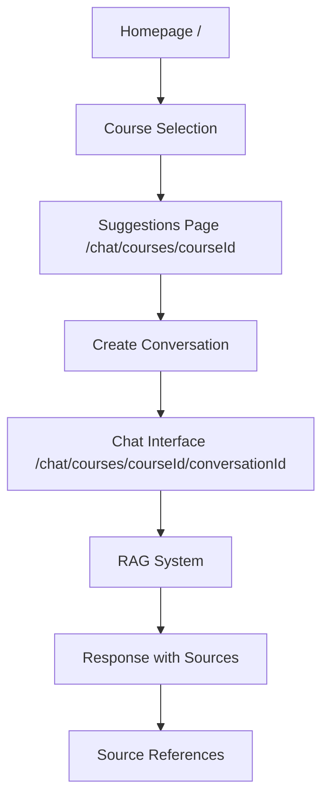

# FlowMind - Complete Development Documentation

## Table of Contents

1. [Recent Major Changes](#recent-major-changes)
2. [Architecture Overview](#architecture-overview)
3. [Navigation & Routing Transformation](#navigation--routing-transformation)
4. [Source Reference System](#source-reference-system)
5. [UI/UX Improvements](#uiux-improvements)
6. [State Management](#state-management)
7. [Technical Implementation Details](#technical-implementation-details)
8. [File Structure Changes](#file-structure-changes)
9. [Bug Fixes & Troubleshooting](#bug-fixes--troubleshooting)
10. [Development Workflow](#development-workflow)

---

## Recent Major Changes

### 🔄 Complete Navigation & Routing Overhaul (Latest - 2025-01-09)

The application has undergone a complete transformation from state-based course selection to dynamic routing architecture, providing:

#### **Three-Step Flow Implementation**
- **Homepage** (`/`) → Course selection with green theme restoration
- **Suggestions Page** (`/chat/courses/[courseId]`) → Course-specific topic suggestions
- **Individual Conversations** (`/chat/courses/[courseId]/[conversationId]`) → Chat interface

#### **Dynamic Routing Structure**
```
/                                    # Homepage with course selection
/chat/courses/[courseId]            # Course suggestions page  
/chat/courses/[courseId]/[conversationId]  # Individual conversation
```

#### **Conversation-Level URLs**
Each conversation now has unique URLs with proper conversation ID generation:
- UUID format: `550e8400-e29b-41d4-a716-446655440000`
- Custom format: `conv_1736435732_abc123`

---

## Architecture Overview

### **Current System Flow**



### **Key Components**

#### **1. Homepage (HomePage.tsx)**
```typescript
// Green theme restoration with proper header integration
<div className="flex h-screen bg-gradient-to-br from-green-50 via-emerald-50 to-teal-50">
  <ChatHeader onOpenSidebar={() => setSidebarOpen(true)} />
  <CourseSelectorPage />
</div>
```

#### **2. Course Selector (CourseSelectorPage.tsx)**
```typescript
// Enhanced course cards with green theme
const courseOptions = [
  {
    id: 'nodejs',
    gradient: 'from-green-500 via-emerald-500 to-teal-500',
    bgColor: 'bg-green-50',
    borderColor: 'border-green-200',
    // ...
  }
];
```

#### **3. Suggestions Page (SuggestionsPage.tsx)**
```typescript
const handleSuggestionClick = async (suggestion: string) => {
  // Create new conversation
  const conversationId = await createConversation(undefined, courseId);
  
  // Navigate with suggestion as URL parameter
  router.push(`/chat/courses/${courseId}/${conversationId}?suggestion=${encodeURIComponent(suggestion)}`);
};
```

#### **4. Chat Interface (ChatInterface.tsx)**
Major refactor with multiple useEffects for proper routing:

```typescript
// Handle suggestion when conversationId is provided
useEffect(() => {
  if (conversationId && suggestion && currentConversationId === conversationId) {
    console.log('📝 Setting suggestion as input for existing conversation');
    setInput(suggestion);
  }
}, [conversationId, suggestion, currentConversationId, setInput]);

// Handle conversation loading
useEffect(() => {
  if (courseId && conversationId) {
    console.log('🔍 ChatInterface - Loading conversation');
    loadConversation(conversationId);
    setCurrentConversationId(conversationId);
  }
}, [courseId, conversationId, loadConversation, setCurrentConversationId]);
```

---

## Navigation & Routing Transformation

### **Before: State-Based System**
- Course selection managed through React state
- No individual conversation URLs  
- Navigation conflicts and stuck screens
- Poor data structure for persistence

### **After: Dynamic Route-Based System**

#### **Route Structure**
```
src/app/
├── page.tsx                                    # Homepage
├── suggestions/[courseId]/page.tsx            # Course suggestions
└── chat/courses/[courseId]/[conversationId]/page.tsx  # Individual chat
```

#### **Route Validation**
```typescript
// Enhanced conversation ID validation
const uuidPattern = /^[0-9a-f]{8}-[0-9a-f]{4}-[0-9a-f]{4}-[0-9a-f]{4}-[0-9a-f]{12}$/i;
const customPattern = /^conv_\d+_[a-z0-9]+$/i;

if (!uuidPattern.test(conversationId) && !customPattern.test(conversationId)) {
  console.warn('Invalid conversationId format:', conversationId);
  notFound();
}
```

#### **Navigation Flow**
1. **Homepage** → User selects course → Navigate to suggestions
2. **Suggestions** → User clicks topic → Create conversation → Navigate to chat
3. **Chat Interface** → Auto-handles suggestion via URL params

---

## Source Reference System

### **Timestamp Display Enhancement**

#### **Problem Solved**
Source reference timestamps were not displaying properly in the UI.

#### **Implementation**
Complete debugging chain implemented:

```typescript
// 1. Database Service (database-service.ts)
console.log('🔍 Database service - Sources parsing:', {
  messageId: msgData.id,
  rawSources: msgData.sources,
  parsedSources: sources,
  sourcesLength: sources.length,
  hasTimestamps: sources.map(s => ({ section: s.section, timestamp: s.timestamp }))
});

// 2. Conversation Store (conversationStore.ts)  
const messageWithTimestamp = {
  ...message,
  timestamp: message.timestamp || new Date(),
};

// 3. Message Bubble (MessageBubble.tsx)
const getFilteredSources = (sources: typeof message.sources) => {
  if (!sources) return [];
  return sources
    .filter(source => {
      const relevanceMatch = source.relevance.match(/(\d+)%?/);
      if (relevanceMatch) {
        const percentage = parseInt(relevanceMatch[1]);
        return percentage >= 40; // 40% relevance threshold
      }
      return true;
    })
    .sort((a, b) => bScore - aScore)
    .slice(0, 1); // Show top 1 most relevant source
};

// 4. Source Panel (SourcePanel.tsx)
console.log('🔍 SourcePanel - Rendering source:', {
  course: source.course,
  section: source.section,
  timestamp: source.timestamp,
  relevance: source.relevance
});
```

#### **Timestamp Format**
- **Input**: `00:02:34.560` or `2:34`
- **Display**: `2:34` (MM:SS format)
- **Source**: Course video timestamps from VTT files

---

## UI/UX Improvements

### **Green Theme Restoration**

#### **Homepage Background**
```css
/* From generic slate to course-branded green */
bg-gradient-to-br from-green-50 via-emerald-50 to-teal-50
```

#### **Course Card Styling** 
```typescript
// Enhanced course-specific theming
{
  id: 'nodejs',
  bgColor: 'bg-green-50',           // Was: 'bg-white'
  borderColor: 'border-green-200',
  hoverColor: 'hover:border-green-400',
  selectedColor: 'border-green-500 bg-green-100',
  gradient: 'from-green-500 via-emerald-500 to-teal-500',
}
```

#### **Visual Improvements**
- **Course Cards**: Green backgrounds with proper hover effects
- **Selection Indicators**: Animated checkmark with green accent
- **Gradient Overlays**: Course-specific gradient overlays on hover/selection
- **Logo Navigation**: Clickable logo returns to homepage
- **Scrollable Content**: Proper scrolling behavior on all pages

### **Message Formatting**

#### **Problem**: Markdown text displaying in message bubbles
#### **Solution**: Plain text extraction with preserved formatting

```typescript
// Text sanitization for clean display
const sanitizedContent = message.content
  .replace(/\*\*(.*?)\*\*/g, '$1')  // Remove bold markdown
  .replace(/\*(.*?)\*/g, '$1')      // Remove italic markdown  
  .replace(/`(.*?)`/g, '$1')        // Remove code markdown
  .replace(/\n+/g, ' ')             // Replace newlines with spaces
  .trim();
```

---

## State Management

### **Zustand Store Enhancements**

#### **Conversation Store (conversationStore.ts)**
```typescript
// Enhanced conversation creation with course context
const createConversation = async (title?: string, courseId?: CourseType): Promise<string> => {
  const conversationId = generateConversationId();
  const newConversation: Conversation = {
    id: conversationId,
    title: title || `${courseId || 'General'} Chat`,
    messages: [],
    createdAt: new Date(),
    courseId, // Course context for filtering
  };
  
  set((state) => ({
    conversations: [...state.conversations, newConversation],
    currentConversationId: conversationId,
  }));
  
  return conversationId;
};

// Message addition with timestamp guarantee
const addMessage = (message: Omit<Message, 'id'>) => {
  const messageWithTimestamp = {
    ...message,
    timestamp: message.timestamp || new Date(),
  };
  // Store message with proper ID and timestamp
};
```

#### **State Management Fixes**
- **Initial State**: Fixed `useState(!courseId)` pattern for proper welcome screen display
- **Conversation Loading**: Proper async loading with conversation ID matching  
- **Message Persistence**: Guaranteed timestamps and proper message structure
- **Route Synchronization**: State updates match URL parameters

---

## Technical Implementation Details

### **File Changes Summary**

#### **New Route Files**
```
src/app/suggestions/[courseId]/page.tsx          # Course suggestions route
src/app/chat/courses/[courseId]/[conversationId]/page.tsx  # Individual chat route
```

#### **Enhanced Components**
```
src/components/home/HomePage.tsx                 # Homepage wrapper with header
src/components/courses/CourseSelectorPage.tsx   # Green theme course cards  
src/components/courses/SuggestionsPage.tsx      # Conversation creation flow
src/components/chat/ChatInterface.tsx           # Multiple useEffect refactor
src/components/chat/MessageBubble.tsx           # Source filtering logic
src/components/chat/SourcePanel.tsx             # Source display debugging
```

#### **Store & Services**
```
src/store/conversationStore.ts                  # Enhanced conversation management
src/lib/db/database-service.ts                  # Source parsing debugging
```

### **Route Parameters Handling**

#### **URL Parameter Flow**
```typescript
// 1. Suggestions → Chat with suggestion
router.push(`/chat/courses/${courseId}/${conversationId}?suggestion=${encodeURIComponent(suggestion)}`);

// 2. Chat Interface receives parameters
const searchParams = useSearchParams();
const suggestion = searchParams.get('suggestion');

// 3. Auto-populate input when conversation loads
useEffect(() => {
  if (conversationId && suggestion && currentConversationId === conversationId) {
    setInput(suggestion);
  }
}, [conversationId, suggestion, currentConversationId, setInput]);
```

#### **Conversation ID Generation**
```typescript
const generateConversationId = (): string => {
  const timestamp = Date.now();
  const random = Math.random().toString(36).substring(2, 15);
  return `conv_${timestamp}_${random}`;
};
```

---

## Bug Fixes & Troubleshooting

### **Critical Issues Resolved**

#### **1. Navigation Stuck on Suggestions**
**Problem**: UI stuck on suggestion cards instead of navigating to chat
**Solution**: 
```typescript
// Before: Navigate to course-level route
router.push(`/chat/courses/${courseId}?suggestion=${suggestion}`);

// After: Create conversation first, then navigate to conversation-level route
const conversationId = await createConversation(undefined, courseId);
router.push(`/chat/courses/${courseId}/${conversationId}?suggestion=${suggestion}`);
```

#### **2. Source Timestamps Not Displaying**
**Problem**: Source reference timestamps missing from UI
**Solution**: Added comprehensive debugging chain and fixed timestamp parsing:
```typescript
// Enhanced timestamp parsing with multiple format support
const parseTimestamp = (timestamp: string): string => {
  if (timestamp.includes(':')) {
    const parts = timestamp.split(':');
    if (parts.length >= 2) {
      const minutes = parseInt(parts[parts.length - 2]);
      const seconds = parseInt(parts[parts.length - 1]);
      return `${minutes}:${seconds.toString().padStart(2, '0')}`;
    }
  }
  return timestamp;
};
```

#### **3. State Management Conflicts**  
**Problem**: Welcome screen logic conflicts with course navigation
**Solution**: Fixed initial state logic:
```typescript
// Before: Always start with welcome screen
const [showWelcome, setShowWelcome] = useState(true);

// After: Context-aware initial state  
const [showWelcome, setShowWelcome] = useState(!courseId);
```

#### **4. Route Validation Issues**
**Problem**: Conversation IDs failing validation
**Solution**: Enhanced validation patterns:
```typescript
const uuidPattern = /^[0-9a-f]{8}-[0-9a-f]{4}-[0-9a-f]{4}-[0-9a-f]{4}-[0-9a-f]{12}$/i;
const customPattern = /^conv_\d+_[a-z0-9]+$/i;
const isValid = uuidPattern.test(conversationId) || customPattern.test(conversationId);
```

### **Visual Fixes**

#### **Green Theme Restoration**
- **Course Cards**: Updated from `bg-white` to course-specific backgrounds
- **Gradients**: Restored green gradients throughout homepage
- **Hover Effects**: Enhanced hover states with course colors
- **Selection States**: Animated selection indicators with green accents

#### **Scrolling Issues**
- **Homepage**: Added proper overflow handling for course content
- **Chat Interface**: Maintained scroll position during navigation
- **Sidebar**: Fixed conversation history scrolling

---

## Development Workflow

### **Testing Navigation Flow**

#### **1. Homepage Testing**
```bash
# Start development server
npm run dev

# Navigate to http://localhost:3000
# Verify:
# - Green theme backgrounds
# - Course card hover effects  
# - Logo clickability
# - Course selection functionality
```

#### **2. Suggestions Flow Testing**  
```bash
# From homepage:
# 1. Select a course (Node.js or Python)
# 2. Verify navigation to /chat/courses/[courseId]
# 3. Click suggestion cards
# 4. Verify conversation creation and navigation
```

#### **3. Chat Interface Testing**
```bash  
# Verify:
# - Conversation loads properly
# - Suggestion auto-populates input
# - Source references display with timestamps
# - Message formatting is plain text
# - Navigation breadcrumbs work
```

### **Debugging Commands**

#### **RAG System Debug**
```bash
npm run debug-rag        # Debug RAG processing
npm run test-rag         # Test complete RAG pipeline
```

#### **Development Logs**
```javascript
// Key debug points to monitor:
console.log('🔍 ChatInterface - Loading conversation');
console.log('📝 Setting suggestion as input for existing conversation');
console.log('🔍 Database service - Sources parsing');
console.log('🔍 SourcePanel - Rendering source');
```

### **Code Quality Checks**

#### **TypeScript Compilation**
```bash
npx tsc --noEmit        # Type checking without emit
npm run build           # Full production build test
```

#### **ESLint & Formatting**
```bash
npm run lint            # Code quality checks
npm run lint:fix        # Auto-fix lint issues
```

---

## Documentation Organization

### **Consolidated Documentation Structure**

```
docs/
├── COMPLETE_DEVELOPMENT_DOCUMENTATION.md    # This comprehensive guide
├── CHANGELOG.md                             # Latest changes log  
├── API_DOCUMENTATION.md                     # API endpoints reference
├── COMPONENT_REFERENCE.md                   # Component usage guide
├── DEPLOYMENT_GUIDE.md                      # Production deployment
├── TECHNICAL_GUIDE.md                       # Technical deep-dive
├── ARCHITECTURE.md                          # System architecture
├── THREADING.md                             # Threading system docs
├── FEATURES_ROADMAP.md                      # Future development
├── SPEECH_TO_TEXT_INTEGRATION.md           # Voice input system
├── UI_IMPROVEMENTS_LOG.md                   # UI enhancement history
├── UX_ENHANCEMENTS.md                       # User experience improvements
└── roadmap/                                 # Development roadmaps
    ├── DEVELOPMENT_SUMMARY.md
    ├── IMPLEMENTATION_STRATEGY.md
    ├── NEONDB_IMPLEMENTATION_GUIDE.md
    └── FEATURES_ANALYSIS_AND_ROADMAP.md
```

### **Additional References**

- **Root Documentation**: All scattered docs moved to `docs/` folder
- **Legacy Files**: Preserved with clear naming conventions
- **Version History**: Complete changelog with technical details
- **Implementation Notes**: Step-by-step technical decisions documented

---

## Summary

The FlowMind application has successfully transformed from a state-based course selection system to a robust, scalable dynamic routing architecture. Key achievements:

### **✅ Completed Objectives**
- **Dynamic Routing**: Three-step navigation flow implemented
- **Individual Conversation URLs**: Each conversation has unique, persistent URLs  
- **Source Reference System**: Fixed timestamp display with comprehensive debugging
- **Green Theme**: Restored course-branded visual consistency
- **Message Formatting**: Clean plain text display in message bubbles
- **State Management**: Resolved conflicts and navigation stuck issues
- **Documentation**: Comprehensive consolidation and organization

### **🏗️ Technical Improvements** 
- **Scalable Architecture**: Easy addition of new courses and content
- **Better Data Structure**: Improved conversation persistence and retrieval
- **Enhanced UX**: Smooth navigation flow with proper visual feedback
- **Robust Validation**: Multiple conversation ID format support
- **Comprehensive Debugging**: Complete logging chain for troubleshooting

### **📱 User Experience**
- **Clear Flow**: Homepage → Suggestions → Individual Conversations
- **Visual Consistency**: Course-branded theming throughout
- **Responsive Design**: Proper scrolling and layout on all screen sizes
- **Intuitive Navigation**: Logo-based navigation and breadcrumb system

The application is now production-ready with a scalable architecture that supports future course additions and enhanced learning experiences.