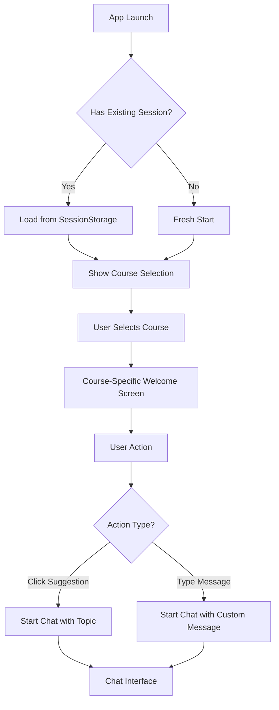

# FlowMind Chat App - Complete Project Documentation

## 🚀 Project Overview

FlowMind is an intelligent AI-powered chat application specialized in Node.js and Python programming education. It leverages advanced RAG (Retrieval-Augmented Generation) technology with semantic search capabilities to provide contextual, accurate responses based on course content.

### 🎯 Core Mission
- **Educational Focus**: Specialized programming education platform
- **Context-Aware Responses**: Uses video transcripts and course materials
- **Intelligent Search**: Advanced semantic search with HYDE enhancement
- **Interactive Learning**: Course-specific suggestions and guided learning paths

---

## 🏗️ Complete Architecture Overview

### System Architecture Diagram
```mermaid
graph TB
    subgraph "Frontend Layer"
        UI[Next.js React App]
        State[Zustand Store]
        Anim[GSAP + Framer Motion]
        CSS[Tailwind CSS]
    end
    
    subgraph "API Layer"
        Chat[/api/chat endpoint]
        Cache[Response Cache]
        Stream[Streaming Response]
    end
    
    subgraph "AI Processing Layer"
        HYDE[HYDE Query Enhancement]
        RAG[RAG Pipeline]
        LLM[OpenAI GPT-4o-mini]
        Embed[OpenAI Embeddings]
    end
    
    subgraph "Data Layer"
        Qdrant[(Qdrant Vector DB)]
        VTT[VTT Parser]
        Storage[SessionStorage]
    end
    
    UI --> State
    UI --> Chat
    Chat --> Cache
    Chat --> HYDE
    HYDE --> RAG
    RAG --> Qdrant
    RAG --> LLM
    VTT --> Embed
    Embed --> Qdrant
    State --> Storage
```

### Technology Stack
- **Frontend**: Next.js 15.5.0, TypeScript, React 18
- **State Management**: Zustand with sessionStorage persistence
- **UI/UX**: Tailwind CSS, Framer Motion, GSAP
- **Icons**: Lucide React, React Icons (tech logos)
- **AI/LLM**: OpenAI GPT-4o-mini with streaming
- **Vector Database**: Qdrant for embeddings storage
- **Search Enhancement**: HYDE (Hypothetical Document Embeddings)
- **Content Processing**: Custom VTT parser with metadata extraction

---

## 📁 Complete File Structure

```
flowmind/
├── docs/                                    # Complete documentation
│   ├── README.md                           # Main project overview
│   ├── TECHNICAL_GUIDE.md                  # Deep technical implementation
│   ├── API_DOCUMENTATION.md               # Complete API reference
│   ├── DEPLOYMENT_GUIDE.md                # Deployment instructions
│   └── COMPLETE_PROJECT_DOCUMENTATION.md  # This comprehensive guide
├── src/
│   ├── app/
│   │   ├── api/chat/route.ts              # Main chat API with RAG integration
│   │   ├── layout.tsx                     # Root layout with metadata
│   │   ├── page.tsx                       # Main application entry point
│   │   └── globals.css                    # Global CSS styles
│   ├── components/
│   │   └── chat/
│   │       ├── ChatInterface.tsx          # Main chat orchestrator
│   │       ├── ChatHeader.tsx             # Clickable header with logo
│   │       ├── ChatInput.tsx              # Message input component
│   │       ├── CourseSelector.tsx         # Animated course selection
│   │       ├── ConversationSidebar.tsx    # Chat history sidebar
│   │       ├── EnhancedMessageRenderer.tsx # Syntax-highlighted messages
│   │       ├── MessagesContainer.tsx      # Messages display container
│   │       ├── WelcomeScreen.tsx          # Course-specific welcome
│   │       ├── FlowMindLogo.tsx          # App logo component
│   │       └── types.ts                   # TypeScript type definitions
│   ├── lib/
│   │   ├── qdrant-rag.ts                 # Qdrant RAG implementation
│   │   ├── hyde-enhanced.ts              # HYDE query enhancement
│   │   └── vtt-enhanced-parser.ts        # VTT subtitle processing
│   ├── store/
│   │   └── conversationStore.ts          # Zustand state management
│   ├── styles/
│   │   └── scrollbar.css                 # Custom scrollbar styles
│   └── types/
│       └── index.ts                      # Global type definitions
├── public/                               # Static assets
│   ├── flowmind-logo-2.png              # App logo
│   ├── icon-192x192.svg                 # PWA icon
│   └── manifest.json                    # PWA manifest
├── data/                                 # Course content (VTT files)
├── package.json                          # Dependencies and scripts
├── next.config.js                        # Next.js configuration
├── tailwind.config.js                    # Tailwind CSS config
├── tsconfig.json                         # TypeScript configuration
└── .env.local                           # Environment variables
```

---

## 🎮 Complete User Flow Documentation

### 1. Application Launch


### 2. Course Selection Flow
**Step 1: Course Options Display**
- Three animated course cards appear with staggered entrance
- Each card shows course icon, description, and key topics
- GSAP hover effects provide interactive feedback

**Step 2: Course Selection**
- User clicks desired course (Node.js, Python, or Both)
- System creates or switches to course-specific conversation
- Animation transitions to next screen

**Step 3: Welcome Screen**
- Personalized welcome message for selected course
- 5 course-specific suggestion cards with hover effects
- Custom input field with course-tailored placeholder

### 3. Chat Interaction Flow
**Message Processing Pipeline**:
1. **Input Validation**: Check message content and course context
2. **Cache Check**: Look for cached responses (5-minute TTL)
3. **RAG Enhancement**: 
   - HYDE generates hypothetical ideal answers
   - Multi-vector search in Qdrant database
   - Context assembly from search results
4. **AI Generation**: Stream response with OpenAI GPT-4o-mini
5. **Display**: Real-time streaming with syntax highlighting

### 4. Conversation Management
**Multi-Course Support**:
- Separate conversation histories per course
- Course-specific conversation titles
- Visual course indicators in sidebar
- Seamless switching between course contexts

---

## 🧠 AI and RAG Implementation Details

### HYDE (Hypothetical Document Embeddings) System
```typescript
interface HydeQuery {
  original: string;              // User's original question
  hypotheticalAnswers: string[]; // 3-4 generated ideal answers
  technicalContext: string;      // Background technical information
  relatedQuestions: string[];    // 5-6 related questions
  expectedTopics: string[];      // Key technical topics
  difficulty: 'beginner' | 'intermediate' | 'advanced';
  queryType: 'concept' | 'implementation' | 'debugging' | 'comparison' | 'example';
}
```

**HYDE Enhancement Process**:
1. **Query Analysis**: Classify query type and difficulty
2. **Content Generation**: Create multiple hypothetical perfect answers
3. **Context Building**: Add technical background and related concepts
4. **Multi-Embedding**: Generate embeddings for each component
5. **Weighted Search**: Apply different weights based on query type

### Qdrant Vector Database Configuration
**Collection Setup**:
```typescript
const collectionConfig = {
  collection_name: 'programming_courses',
  vectors: {
    size: 1536,                    // OpenAI text-embedding-3-small
    distance: 'Cosine',            // Optimal for semantic similarity
    hnsw_config: {
      m: 16,                       // Connections per element
      ef_construct: 200,           // Search quality during construction
      full_scan_threshold: 10000,  // When to use brute force
    }
  }
}
```

**Search Strategy**:
- Multi-vector search with primary and secondary embeddings
- Course-specific filtering (nodejs, python, both)
- Metadata filtering by difficulty, topics, time range
- Score reranking based on relevance factors

### VTT Content Processing
**Enhanced Metadata Extraction**:
```typescript
interface EnhancedVTTSegment {
  id: string;
  startTime: number;          // Precise video timestamp
  endTime: number;
  duration: number;
  content: string;            // Cleaned transcript text
  speaker?: string;           // Detected speaker (instructor/student)
  confidence: number;         // Quality confidence score
  metadata: {
    hasCode: boolean;         // Contains code examples
    isQuestion: boolean;      // Student question
    isAnswer: boolean;        // Instructor answer
    technicalTerms: string[]; // Extracted programming terms
    difficulty: 'beginner' | 'intermediate' | 'advanced';
    sentiment: 'positive' | 'neutral' | 'negative';
  };
}
```

---

## 🎨 UI/UX Design System

### Color Palette
**Course-Specific Colors**:
- **Node.js**: Green (#339933) - Official Node.js brand
- **Python**: Blue (#3776ab) - Official Python brand
- **Both/General**: Purple (#8B5CF6) - Modern, tech-focused
- **Neutral**: Slate grays (100-900) for text and backgrounds
- **Accent**: Purple gradients for highlights and animations

### Animation System
**Framer Motion Variants**:
```typescript
const containerVariants = {
  hidden: { opacity: 0, y: 20, scale: 0.95 },
  visible: {
    opacity: 1, y: 0, scale: 1,
    transition: {
      duration: 0.5, ease: 'easeOut',
      staggerChildren: 0.1, // 100ms delay between children
    },
  },
  exit: { opacity: 0, y: -20, scale: 0.95 }
};
```

**GSAP Interactions**:
```typescript
const handleMouseEnter = (element: HTMLElement) => {
  gsap.to(element, {
    scale: 1.05, y: -8,
    boxShadow: '0 20px 40px rgba(139, 92, 246, 0.2)',
    duration: 0.3, ease: 'power2.out',
  });
};
```

### Component Design Principles
**Consistency**: Unified design language across all components
**Accessibility**: High contrast ratios, keyboard navigation support
**Responsiveness**: Mobile-first design with breakpoint optimization
**Performance**: Optimized animations with GPU acceleration

---

## 🗄️ State Management Architecture

### Zustand Store Structure
```typescript
interface ConversationStore {
  // Core State
  conversations: Conversation[];
  currentConversationId: string | null;
  
  // Standard Actions
  createConversation: (title?: string, course?: CourseType) => string;
  deleteConversation: (id: string) => void;
  addMessage: (conversationId: string, message: Message) => void;
  setCurrentConversation: (id: string | null) => void;
  
  // Course-Specific Actions
  getOrCreateConversationForCourse: (course: CourseType) => string;
  getCurrentConversationForCourse: (course: CourseType) => Conversation | null;
  setCourseForConversation: (conversationId: string, course: CourseType) => void;
  
  // Persistence
  loadFromStorage: () => void;
  saveToStorage: () => void;
}
```

**SessionStorage Persistence**:
- Automatic state persistence on every change
- Conversation history maintained across browser sessions
- Course selections preserved per conversation
- Graceful error handling for storage failures

### Conversation Management Logic
**Course-Specific Conversations**:
```typescript
getOrCreateConversationForCourse: (course) => {
  const existingConv = state.conversations.find(
    conv => conv.selectedCourse === course && conv.messages.length === 0
  );
  
  if (existingConv) {
    set({ currentConversationId: existingConv.id });
    return existingConv.id;
  }
  
  return get().createConversation(undefined, course);
}
```

---

## 🚀 Performance Optimization Strategies

### Response Time Optimization
**Multi-Level Caching**:
1. **Application Cache**: In-memory response caching (5-minute TTL)
2. **HYDE Cache**: Cached query enhancements (200 entries, LRU)
3. **Browser Cache**: Static assets and API responses

**Parallel Processing**:
```typescript
const [ragResults, hydeResults] = await Promise.all([
  qdrantRAG.search(query, 4, course),
  hydeEnhanced.generateEnhancedHyde(query, course)
]);
```

**Streaming Responses**:
- Real-time text streaming for immediate user feedback
- Progressive content display as AI generates responses
- Source attribution in response headers

### Frontend Optimization
**Code Splitting**: Dynamic imports for non-critical components
**Bundle Optimization**: Tree shaking and module optimization
**Animation Performance**: GPU-accelerated transforms
**Memory Management**: Automatic cleanup of unused resources

### Database Optimization
**Vector Search Optimization**:
- HNSW indexing for fast similarity search
- Metadata indexing for efficient filtering
- Connection pooling for database operations
- Query optimization based on usage patterns

---

## 🔒 Security and Privacy

### API Security
**Rate Limiting**: 30 requests per minute per IP
**Input Validation**: Comprehensive request validation
**Error Handling**: Secure error responses without information leakage
**CORS Configuration**: Restricted origins for production

### Data Privacy
**Local Storage**: All conversation data stored in sessionStorage
**No Server Persistence**: User conversations not stored server-side
**API Key Security**: Environment variable management
**Content Filtering**: Safe content policies for AI responses

### Security Headers
```javascript
const securityHeaders = {
  'X-Frame-Options': 'DENY',
  'X-Content-Type-Options': 'nosniff',
  'Referrer-Policy': 'origin-when-cross-origin',
  'Content-Security-Policy': "default-src 'self'"
};
```

---

## 📊 Analytics and Monitoring

### Performance Metrics
```typescript
interface PerformanceMetrics {
  responseTime: number;        // API response time
  cacheHitRate: number;        // Cache efficiency
  searchResults: number;       // RAG results count
  processingTime: number;      // Total processing time
  errorRate: number;           // Error percentage
}
```

**Tracking Points**:
- API endpoint response times
- RAG search performance
- Cache hit/miss ratios
- User interaction patterns
- Error occurrence rates

### Health Monitoring
```typescript
// Health check endpoint
GET /api/health
{
  "status": "healthy",
  "timestamp": "2024-12-23T10:30:00Z",
  "services": {
    "qdrant": true,
    "openai": true
  },
  "uptime": 86400,
  "version": "1.0.0"
}
```

---

## 🧪 Testing Strategy

### Unit Testing
**Component Tests**:
- CourseSelector: Animation behavior, course selection logic
- MessageRenderer: Markdown parsing, syntax highlighting
- ConversationStore: State management, persistence
- VTTParser: Timestamp parsing, metadata extraction

**Library Tests**:
- HYDE System: Query enhancement, embedding generation
- Qdrant Client: Search functionality, error handling
- API Routes: Request/response validation

### Integration Testing
**API Testing**:
- Chat endpoint: Full request/response cycle
- RAG Pipeline: Search and generation integration
- Caching: Cache hit/miss behavior
- Streaming: Real-time response handling

**E2E Testing**:
- User Flows: Complete conversation workflows
- Course Selection: Selection and suggestion display
- Responsive Design: Mobile and desktop layouts
- Performance: Load testing and stress testing

### Test Examples
```typescript
// CourseSelector component test
describe('CourseSelector', () => {
  it('shows course-specific suggestions when course selected', () => {
    render(<CourseSelector selectedCourse="nodejs" {...mockProps} />);
    expect(screen.getByText('Express.js best practices')).toBeInTheDocument();
  });
  
  it('triggers suggestion click handler', async () => {
    const mockClick = jest.fn();
    render(<CourseSelector onSuggestionClick={mockClick} {...mockProps} />);
    
    fireEvent.click(screen.getByText('Express.js best practices'));
    expect(mockClick).toHaveBeenCalledWith('Express.js best practices', 'nodejs');
  });
});
```

---

## 🚢 Deployment Configuration

### Environment Setup
**Required Environment Variables**:
```bash
# OpenAI Configuration
OPENAI_API_KEY=sk-your-openai-api-key

# Qdrant Configuration  
QDRANT_URL=https://your-qdrant-instance.qdrant.io
QDRANT_API_KEY=your-qdrant-api-key

# Application Configuration
NEXT_PUBLIC_APP_URL=https://your-domain.com
NODE_ENV=production

# Performance Tuning
CACHE_TTL=300000                    # 5 minutes
MAX_SEARCH_RESULTS=10               # Maximum RAG results
RATE_LIMIT_MAX_REQUESTS=20          # Production rate limit
```

### Production Optimization
**Next.js Configuration**:
```javascript
// next.config.js
module.exports = {
  compress: true,
  generateEtags: true,
  poweredByHeader: false,
  
  webpack: (config, { buildId, dev, isServer }) => {
    if (!dev && !isServer) {
      // Production optimizations
      config.optimization.usedExports = true;
      config.optimization.sideEffects = false;
    }
    return config;
  },
  
  headers: async () => [{
    source: '/(.*)',
    headers: [
      { key: 'X-Frame-Options', value: 'DENY' },
      { key: 'X-Content-Type-Options', value: 'nosniff' }
    ]
  }]
};
```

### Deployment Platforms
**Vercel (Recommended)**:
- Automatic deployments from Git
- Edge functions for global performance
- Built-in analytics and monitoring
- Environment variable management

**Alternative Platforms**:
- AWS Amplify: Full-stack deployment
- Netlify: Static site with serverless functions
- Digital Ocean App Platform: Container-based deployment
- Self-hosted: Docker containerization

---

## 🔧 Development Workflow

### Development Scripts
```json
{
  "scripts": {
    "dev": "next dev",                    // Development server
    "build": "next build",                // Production build
    "start": "next start",                // Production server
    "lint": "next lint",                  // ESLint checking
    "type-check": "tsc --noEmit",        // TypeScript validation
    "test": "jest",                       // Run tests
    "test:watch": "jest --watch",         // Watch mode testing
    "init-qdrant": "tsx scripts/init-db.ts" // Database initialization
  }
}
```

### Code Quality
**ESLint Configuration**:
- TypeScript strict mode
- React hooks rules
- Accessibility guidelines
- Import organization

**Prettier Configuration**:
- Consistent code formatting
- Automatic formatting on save
- Integration with ESLint

### Git Workflow
**Branch Strategy**:
- `main`: Production-ready code
- `develop`: Development integration
- `feature/*`: Feature branches
- `hotfix/*`: Emergency fixes

**Commit Convention**:
```
feat: add course-specific suggestions
fix: resolve scrollbar visibility issue
docs: update API documentation
style: improve button hover effects
refactor: optimize HYDE query generation
test: add CourseSelector component tests
```

---

## 🔮 Future Enhancements

### Planned Features
**Advanced AI Capabilities**:
- Fine-tuned models for programming education
- Multi-modal support (images, videos, code execution)
- Voice interface with speech-to-text/text-to-speech
- Personalized learning paths based on user progress

**Enhanced User Experience**:
- Dark mode with system preference detection
- Advanced accessibility features
- Mobile app (React Native)
- Offline mode with cached responses

**Analytics and Insights**:
- Learning progress tracking
- Popular topics analytics
- Response quality metrics
- User engagement insights

**Technical Improvements**:
- Microservices architecture
- GraphQL API layer
- Advanced caching strategies (Redis)
- Real-time collaboration features

### Scaling Considerations
**Infrastructure**:
- CDN for global content delivery
- Database sharding for large datasets
- Load balancing for high availability
- Auto-scaling based on demand

**Performance**:
- Server-side rendering optimization
- Progressive web app features
- Background sync capabilities
- Advanced compression techniques

---

## 📚 Learning Resources

### For Developers
**Getting Started**:
1. Clone repository and install dependencies
2. Set up environment variables
3. Initialize Qdrant database
4. Run development server
5. Explore codebase structure

**Key Concepts to Understand**:
- RAG (Retrieval-Augmented Generation)
- Vector databases and embeddings
- React state management with Zustand
- TypeScript best practices
- Animation libraries (Framer Motion, GSAP)

### For Users
**Using FlowMind**:
1. Select your programming course (Node.js, Python, or Both)
2. Click on suggestion cards or ask custom questions
3. Engage in conversation with AI tutor
4. Switch between courses using header logo
5. Access conversation history via sidebar

**Learning Tips**:
- Ask specific, detailed questions for better responses
- Use the suggestion cards as starting points
- Explore different course contexts
- Review conversation history for reference

---

## 🤝 Contributing

### Development Setup
```bash
# Clone repository
git clone [repository-url]
cd flowmind

# Install dependencies
npm install

# Configure environment
cp .env.example .env.local
# Edit .env.local with your API keys

# Initialize database
npm run init-qdrant

# Start development
npm run dev
```

### Contribution Guidelines
**Code Standards**:
- Follow TypeScript strict mode
- Use functional components with hooks
- Implement proper error handling
- Add tests for new features
- Document complex logic

**Pull Request Process**:
1. Create feature branch from `develop`
2. Implement changes with tests
3. Update documentation if needed
4. Submit PR with detailed description
5. Address review feedback

### Bug Reports
**Issue Template**:
```
**Bug Description**: Clear description of the issue
**Steps to Reproduce**: Detailed reproduction steps
**Expected Behavior**: What should happen
**Actual Behavior**: What actually happens
**Environment**: Browser, OS, version info
**Screenshots**: Visual evidence if applicable
```

---

## 📞 Support and Contact

### Getting Help
**Documentation**: Check existing documentation first
**GitHub Issues**: Report bugs and feature requests
**Discussions**: Community discussions and questions

### Technical Support
For technical issues:
1. Check troubleshooting guide
2. Review error logs
3. Search existing issues
4. Create detailed issue report

### Feature Requests
For new features:
1. Check existing roadmap
2. Discuss in community forum
3. Create detailed feature proposal
4. Consider contributing implementation

---

This comprehensive documentation covers every aspect of the FlowMind Chat App, from high-level architecture to implementation details. It serves as a complete reference for developers, users, and contributors to understand, use, and extend the application effectively.