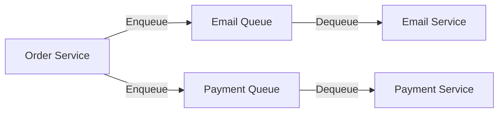

# Queue Workers & Asynchronous Communication

## Overview

This document covers queue-based worker systems and asynchronous communication patterns in microservice architectures, as covered in the Node.js System Design course content.

## Queue System Architecture

### What is a Queue?

A **queue** is a data structure that follows the **FIFO (First In, First Out)** principle. In a microservice architecture, queues enable asynchronous communication between services, allowing them to communicate without blocking or waiting for immediate responses.

### Core Concepts

#### 1. **Queue Operations**

```typescript
interface QueueSystem {
  enqueue(message: any): Promise<void>  // Push message to queue
  dequeue(): Promise<any>               // Pull message from queue
  peek(): Promise<any>                  // View next message without removing
  size(): Promise<number>               // Get queue size
}
```

**Enqueue (Push)**
- Add messages to the queue
- Instant operation - no waiting required
- "Fire and forget" pattern
- Producer doesn't need to know if consumers exist

**Dequeue (Pull/Poll)**
- Remove messages from the queue
- Consumers work at their own pace
- Controlled processing rate
- Sequential processing: 1, 2, 3, 4...

#### 2. **Message Flow**



## Microservice Communication Pattern

### Traditional Synchronous Pattern

```typescript
// ❌ Synchronous - Blocking
async function placeOrder(orderData) {
  const order = await createOrder(orderData)
  await sendEmail(order)      // Wait for email
  await processPayment(order) // Wait for payment
  return order
}
```

**Problems:**
- Order service waits for email service
- If email service is down, orders fail
- No rate limiting or throttling
- Tight coupling between services

### Queue-Based Asynchronous Pattern

```typescript
// ✅ Asynchronous - Non-blocking
async function placeOrder(orderData) {
  const order = await createOrder(orderData)

  // Just push to queues and continue
  await emailQueue.enqueue({ orderId: order.id, email: order.userEmail })
  await paymentQueue.enqueue({ orderId: order.id, amount: order.total })

  return order // Immediately return
}
```

**Benefits:**
- Order service doesn't wait
- Services are decoupled
- Graceful degradation
- Built-in rate limiting

## Real-World Example: E-commerce Order System

### Architecture Diagram

```
┌─────────────────┐
│  Order Service  │
└────────┬────────┘
         │
         ├─────► [Email Queue] ────► Email Service (5 msg/sec)
         │
         └─────► [Payment Queue] ──► Payment Service (10 msg/sec)
```

### Scenario: High Traffic Order Processing

**Situation:**
- Orders placed: **100 orders/second**
- Email service capacity: **5 emails/second**
- Payment service capacity: **10 payments/second**

**Without Queue:**
```
❌ Email service crashes due to overload
❌ Payment service struggles with spikes
❌ Order service times out waiting
❌ Lost orders and poor user experience
```

**With Queue:**
```
✅ Orders instantly queued (100/sec)
✅ Email service processes at steady 5/sec
✅ Payment service processes at steady 10/sec
✅ No lost data - messages wait in queue
✅ Users get immediate order confirmation
```

### Implementation Example

```typescript
// Message Queue Interface
interface MessageQueue {
  name: string
  enqueue(message: any): Promise<void>
  dequeue(): Promise<any | null>
  size(): Promise<number>
}

// Order Service - Producer
class OrderService {
  constructor(
    private emailQueue: MessageQueue,
    private paymentQueue: MessageQueue
  ) {}

  async createOrder(orderData: OrderData) {
    // 1. Create order in database
    const order = await this.db.orders.create(orderData)

    // 2. Enqueue email notification (instant)
    await this.emailQueue.enqueue({
      type: 'order_confirmation',
      orderId: order.id,
      email: order.customerEmail,
      orderDetails: order
    })

    // 3. Enqueue payment processing (instant)
    await this.paymentQueue.enqueue({
      type: 'process_payment',
      orderId: order.id,
      amount: order.total,
      paymentMethod: order.paymentMethod
    })

    // 4. Return immediately - don't wait for email or payment
    return order
  }
}

// Email Service - Consumer/Worker
class EmailWorker {
  constructor(
    private emailQueue: MessageQueue,
    private emailService: EmailService
  ) {}

  async start() {
    // Poll queue continuously
    while (true) {
      try {
        // Controlled rate: process 5 messages per second
        const messages = await this.emailQueue.dequeueBatch(5)

        // Process messages in parallel
        await Promise.all(
          messages.map(msg => this.processMessage(msg))
        )

        // Wait 1 second before next batch
        await this.sleep(1000)
      } catch (error) {
        console.error('Email worker error:', error)
        await this.sleep(5000) // Back off on error
      }
    }
  }

  private async processMessage(message: any) {
    const { type, email, orderDetails } = message

    switch (type) {
      case 'order_confirmation':
        await this.emailService.sendOrderConfirmation(email, orderDetails)
        break
      // Handle other email types...
    }
  }

  private sleep(ms: number) {
    return new Promise(resolve => setTimeout(resolve, ms))
  }
}
```

## Popular Queue Systems

### 1. **AWS SQS (Simple Queue Service)**

```typescript
import { SQSClient, SendMessageCommand, ReceiveMessageCommand } from '@aws-sdk/client-sqs'

const sqsClient = new SQSClient({ region: 'us-east-1' })

// Producer
async function enqueueOrder(orderData: any) {
  await sqsClient.send(new SendMessageCommand({
    QueueUrl: 'https://sqs.us-east-1.amazonaws.com/123456789/order-queue',
    MessageBody: JSON.stringify(orderData)
  }))
}

// Consumer
async function pollQueue() {
  const response = await sqsClient.send(new ReceiveMessageCommand({
    QueueUrl: 'https://sqs.us-east-1.amazonaws.com/123456789/order-queue',
    MaxNumberOfMessages: 10,
    WaitTimeSeconds: 20
  }))

  return response.Messages || []
}
```

**Features:**
- Fully managed by AWS
- Scales automatically
- Dead letter queues for failed messages
- Message retention up to 14 days

### 2. **Redis Queue (Bull/BullMQ)**

```typescript
import { Queue, Worker } from 'bullmq'

// Create queue
const emailQueue = new Queue('emails', {
  connection: {
    host: 'localhost',
    port: 6379
  }
})

// Producer
await emailQueue.add('send-email', {
  to: 'user@example.com',
  subject: 'Order Confirmation',
  orderId: '12345'
})

// Consumer/Worker
const worker = new Worker('emails', async (job) => {
  const { to, subject, orderId } = job.data
  await sendEmail(to, subject, orderId)
}, {
  connection: { host: 'localhost', port: 6379 }
})
```

**Features:**
- Fast in-memory operations
- Job scheduling and delayed jobs
- Priority queues
- Job retries and backoff strategies

### 3. **RabbitMQ**

```typescript
import amqp from 'amqplib'

// Producer
async function publishMessage(queueName: string, message: any) {
  const connection = await amqp.connect('amqp://localhost')
  const channel = await connection.createChannel()

  await channel.assertQueue(queueName, { durable: true })
  channel.sendToQueue(queueName, Buffer.from(JSON.stringify(message)), {
    persistent: true
  })

  await channel.close()
  await connection.close()
}

// Consumer
async function consumeMessages(queueName: string) {
  const connection = await amqp.connect('amqp://localhost')
  const channel = await connection.createChannel()

  await channel.assertQueue(queueName, { durable: true })
  channel.prefetch(5) // Process 5 messages at a time

  channel.consume(queueName, async (msg) => {
    if (msg) {
      const data = JSON.parse(msg.content.toString())
      await processMessage(data)
      channel.ack(msg)
    }
  })
}
```

**Features:**
- Message routing and exchanges
- Topic-based subscriptions
- Message acknowledgment
- High availability clustering

## Benefits of Queue-Based Architecture

### 1. **Decoupling**

Services don't need to know about each other:
```
Order Service → Queue → Email Service
                 ↓
            Payment Service
```

- Order service doesn't care how emails are sent
- Email service doesn't know where messages come from
- Services can be developed independently

### 2. **Scalability**

Control processing rates per service:
```typescript
// Email service: 5 messages/sec
// Payment service: 10 messages/sec
// Inventory service: 50 messages/sec

// Each service scales independently based on its capacity
```

### 3. **Reliability & Fault Tolerance**

**Service Downtime Scenario:**

```
Time: 10:00 AM - Email service goes DOWN
├─ Orders continue to flow (100/sec)
├─ Email queue grows: 100 → 200 → 300 messages
└─ No lost data

Time: 10:05 AM - Email service comes UP
├─ Starts processing queued messages
├─ 300 messages / 5 per sec = 60 seconds to catch up
└─ All emails delivered (with slight delay)
```

**Key Points:**
- Messages persist in queue during service outages
- No data loss
- Automatic recovery when service restarts
- Users receive delayed notifications (better than no notifications)

### 4. **Load Leveling**

Smooth out traffic spikes:
```
Peak Traffic: 1000 orders/min
├─ Instantly queued: 1000 messages added to queue
├─ Processing: Steady rate of 10 messages/sec
└─ Queue empties over ~2 minutes
```

## Advanced Queue Patterns

### 1. **Dead Letter Queue (DLQ)**

Handle failed messages:
```typescript
const emailQueue = new Queue('emails', {
  defaultJobOptions: {
    attempts: 3,
    backoff: {
      type: 'exponential',
      delay: 2000
    }
  }
})

// After 3 failed attempts, message moves to DLQ
const dlq = new Queue('emails-dlq')

worker.on('failed', async (job, error) => {
  if (job.attemptsMade >= 3) {
    await dlq.add('failed-email', {
      originalJob: job.data,
      error: error.message,
      failedAt: new Date()
    })
  }
})
```

### 2. **Priority Queues**

Process important messages first:
```typescript
// High priority: VIP customer orders
await orderQueue.add('vip-order', orderData, { priority: 1 })

// Normal priority: Regular orders
await orderQueue.add('regular-order', orderData, { priority: 5 })

// Low priority: Batch reports
await orderQueue.add('report', reportData, { priority: 10 })
```

### 3. **Delayed Jobs**

Schedule messages for later:
```typescript
// Send reminder email in 24 hours
await emailQueue.add('reminder', {
  orderId: '12345',
  type: 'payment_reminder'
}, {
  delay: 24 * 60 * 60 * 1000 // 24 hours
})
```

### 4. **Fan-Out Pattern**

One message triggers multiple consumers:
```
Order Created
    ├─→ Email Queue → Send confirmation email
    ├─→ SMS Queue → Send SMS notification
    ├─→ Analytics Queue → Track order metrics
    └─→ Inventory Queue → Update stock
```

```typescript
async function handleOrderCreated(order: Order) {
  // Fan out to multiple queues
  await Promise.all([
    emailQueue.add('confirmation', { orderId: order.id }),
    smsQueue.add('notification', { phone: order.phone }),
    analyticsQueue.add('track', { event: 'order_created', orderId: order.id }),
    inventoryQueue.add('update', { items: order.items })
  ])
}
```

## Best Practices

### 1. **Message Design**

```typescript
// ✅ Good: Small, focused messages
interface EmailMessage {
  type: 'order_confirmation' | 'password_reset'
  userId: string
  data: {
    orderId?: string
    resetToken?: string
  }
}

// ❌ Bad: Large, complex messages
interface BadMessage {
  user: CompleteUserObject  // Too large
  order: CompleteOrderObject
  inventory: InventorySnapshot
  // ... huge payload
}
```

### 2. **Idempotency**

Ensure messages can be processed multiple times safely:
```typescript
async function processPayment(message: PaymentMessage) {
  const { orderId, amount } = message

  // Check if already processed
  const existing = await db.payments.findOne({ orderId })
  if (existing && existing.status === 'completed') {
    console.log(`Payment for ${orderId} already processed`)
    return // Skip duplicate processing
  }

  // Process payment
  await paymentGateway.charge(amount)
  await db.payments.create({ orderId, amount, status: 'completed' })
}
```

### 3. **Error Handling**

```typescript
class EmailWorker {
  async processMessage(message: any) {
    try {
      await this.sendEmail(message)
    } catch (error) {
      if (this.isRetryable(error)) {
        // Retry with exponential backoff
        throw error
      } else {
        // Move to DLQ
        await this.moveToDLQ(message, error)
      }
    }
  }

  private isRetryable(error: Error): boolean {
    // Network errors: retry
    // Invalid email: don't retry
    return error.code === 'NETWORK_ERROR' ||
           error.code === 'TIMEOUT'
  }
}
```

### 4. **Monitoring & Observability**

```typescript
interface QueueMetrics {
  queueSize: number
  messagesProcessed: number
  messagesFailedRate: number
  averageProcessingTime: number
  oldestMessageAge: number
}

// Alert if queue growing too large
if (metrics.queueSize > 10000) {
  await alerting.send({
    severity: 'high',
    message: `Email queue backed up: ${metrics.queueSize} messages`
  })
}
```

## When to Use Queues

### ✅ Use Queues When:

1. **Asynchronous processing is acceptable**
   - Email notifications
   - Report generation
   - Data synchronization
   - Log processing

2. **Services have different processing speeds**
   - Fast API → Slow external service
   - Batch operations
   - Rate-limited APIs

3. **Need to decouple services**
   - Microservice communication
   - Event-driven architecture
   - Service independence

4. **Handling traffic spikes**
   - Black Friday sales
   - Marketing campaigns
   - Viral events

### ❌ Don't Use Queues When:

1. **Need immediate response**
   - User login
   - Payment authorization
   - Real-time chat
   - Search queries

2. **Strict ordering required**
   - Financial transactions (use databases instead)
   - State machines with dependencies

3. **Request-response pattern needed**
   - API calls requiring immediate data
   - Synchronous workflows

## Related Patterns

### Message Bus vs Queue

**Queue:** One-to-one (point-to-point)
```
Producer → Queue → Consumer
```

**Message Bus/Pub-Sub:** One-to-many (broadcast)
```
Publisher → Topic → Subscriber 1
                  → Subscriber 2
                  → Subscriber 3
```

### Event Sourcing

Store events in queue for replay:
```typescript
// Events in queue
events = [
  { type: 'OrderCreated', orderId: '123', timestamp: '...' },
  { type: 'PaymentProcessed', orderId: '123', timestamp: '...' },
  { type: 'OrderShipped', orderId: '123', timestamp: '...' }
]

// Rebuild state by replaying events
const currentState = events.reduce(applyEvent, initialState)
```

## Summary

Queue workers enable:
- **Asynchronous communication** between services
- **Decoupled architecture** for independent scaling
- **Fault tolerance** through message persistence
- **Load leveling** to handle traffic spikes
- **Rate limiting** for controlled processing

**Key Takeaway:** In microservice architectures, queues act as a communication protocol that allows services to work independently at their own pace, resulting in more scalable, reliable, and maintainable systems.

## Resources

- **Course Content:** Node.js System Design - Queue & Async Communication
- **AWS SQS:** https://aws.amazon.com/sqs/
- **RabbitMQ:** https://www.rabbitmq.com/
- **Bull/BullMQ:** https://github.com/OptimalBits/bull
- **Redis:** https://redis.io/

---

**Part of Neruvi Documentation** - AI Learning Navigator for Node.js and Python
