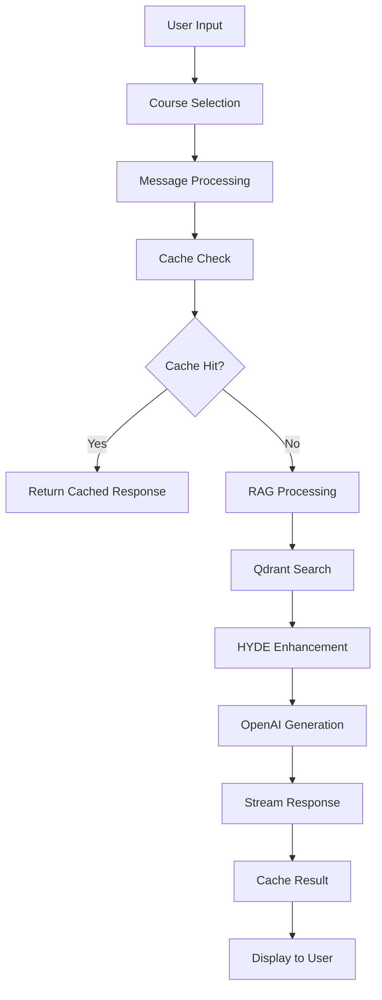

# FlowMind Chat App - Comprehensive Documentation

## 🚀 Project Overview

FlowMind is an intelligent AI-powered chat application specialized in Node.js and Python programming education. It leverages advanced RAG (Retrieval-Augmented Generation) technology with semantic search capabilities to provide contextual, accurate responses based on course content.

### 🎯 Core Purpose
- **Educational Focus**: Specialized for programming education in Node.js and Python
- **Context-Aware**: Uses video transcripts and course materials for accurate responses
- **Intelligent Search**: Advanced semantic search with HYDE (Hypothetical Document Embeddings)
- **Interactive UI**: Modern, animated interface with course selection and suggestions

### 🏗️ Technology Stack
- **Frontend**: Next.js 15.5.0 with TypeScript
- **State Management**: Zustand with sessionStorage persistence
- **UI Framework**: Tailwind CSS with Framer Motion animations
- **Icons**: Lucide React + React Icons for tech logos
- **Animations**: GSAP + Framer Motion
- **AI/LLM**: OpenAI GPT-4o-mini with streaming responses
- **Vector Database**: Qdrant for embeddings storage
- **Search Enhancement**: HYDE query generation
- **Data Processing**: Custom VTT parser for video transcripts

---

## 📁 Project Structure

```
flowmind/
├── src/
│   ├── app/
│   │   ├── api/chat/route.ts          # Main chat API endpoint
│   │   ├── layout.tsx                 # Root layout with metadata
│   │   └── page.tsx                   # Main chat interface
│   ├── components/
│   │   └── chat/
│   │       ├── ChatInterface.tsx      # Main chat component
│   │       ├── ChatHeader.tsx         # Header with app branding
│   │       ├── CourseSelector.tsx     # Animated course selection
│   │       └── EnhancedMessageRenderer.tsx # Message display with syntax highlighting
│   ├── lib/
│   │   ├── qdrant-rag.ts             # Qdrant vector search system
│   │   ├── hyde-enhanced.ts          # HYDE query generation
│   │   └── vtt-enhanced-parser.ts    # VTT subtitle parsing
│   ├── store/
│   │   └── conversationStore.ts      # Zustand state management
│   └── types/
│       └── index.ts                  # TypeScript type definitions
├── docs/                             # Documentation directory
├── public/                           # Static assets
└── data/                            # Course content and transcripts
```

---

## 🧠 Core Systems Architecture

### 1. Chat System Flow



### 2. RAG (Retrieval-Augmented Generation) Pipeline

**Step 1: Query Enhancement with HYDE**
```typescript
// HYDE generates hypothetical answers to improve search
const hydeResult = await hydeEnhanced.generateEnhancedHyde(query, course);
// Creates: hypothetical answers, technical context, related questions
```

**Step 2: Vector Search with Qdrant**
```typescript
// Multi-vector search with course filtering
const searchResults = await qdrantRAG.search(query, 4, selectedCourse);
// Returns: relevant content chunks with metadata and scores
```

**Step 3: Context Assembly**
```typescript
// Rich context creation from search results
const ragContext = searchResults.map((result, index) =>
  `## Context ${index + 1}: ${result.metadata.course.toUpperCase()} - ${result.metadata.section}
   **Relevance**: ${result.metadata.relevance_reason}
   **Content**: ${result.content}`
).join('\n\n');
```

**Step 4: AI Generation**
```typescript
// Stream response with enriched context
const result = streamText({
  model: openai('gpt-4o-mini'),
  system: systemPrompt + ragContext,
  messages,
  temperature: 0.7
});
```

---

## 🎨 User Interface Components

### CourseSelector Component

**Purpose**: Provides animated course selection with suggestions

**Key Features**:
- **Tech Icons**: Official Node.js (green) and Python (blue) icons
- **GSAP Animations**: Smooth hover effects with scale, rotation, shadow
- **Course Suggestions**: Dynamic suggestion cards based on selection
- **Responsive Design**: 3-column course grid, 5-column suggestions

**Animation Timeline**:
1. **Initial Load**: Staggered entrance animations (0.1s delay between cards)
2. **Hover Effects**: Scale (1.05x), lift (-8px), shadow enhancement
3. **Selection**: Check mark animation with spring physics
4. **Suggestions**: Reveal with scale and opacity transitions

**Implementation Details**:
```typescript
// GSAP hover animation
const handleMouseEnter = (courseId: CourseType) => {
  gsap.to(card, {
    scale: 1.05,
    y: -8,
    boxShadow: '0 20px 40px rgba(139, 92, 246, 0.2)',
    duration: 0.3,
    ease: 'power2.out'
  });
};
```

### EnhancedMessageRenderer Component

**Purpose**: Displays chat messages with syntax highlighting

**Features**:
- **Code Detection**: Automatic language detection for syntax highlighting
- **Prism.js Integration**: Beautiful code blocks with dark theme
- **Copy Functionality**: One-click code copying
- **Markdown Support**: Full markdown rendering with custom styles

**Code Block Processing**:
```typescript
// Language detection and highlighting
const detectLanguage = (code: string): string => {
  if (/import\s+.*from|require\(|module\.exports/.test(code)) return 'javascript';
  if (/def\s+\w+|import\s+\w+|from\s+\w+\s+import/.test(code)) return 'python';
  return 'javascript'; // default
};
```

---

## 🗄️ Data Management

### Zustand State Management

**Store Structure**:
```typescript
interface ConversationStore {
  conversations: Conversation[];
  currentConversationId: string | null;
  selectedCourse: CourseType | null;
  // Actions
  createConversation: (course?: CourseType) => string;
  addMessage: (conversationId: string, message: Message) => void;
  setCourseForConversation: (conversationId: string, course: CourseType) => void;
}
```

**SessionStorage Persistence**:
- **Automatic Saving**: Every state change persists to sessionStorage
- **Hydration**: App state restored on page reload
- **Course Tracking**: Each conversation remembers selected course

### VTT Parser System

**Purpose**: Processes video transcript files for RAG content

**Enhanced Features**:
- **Speaker Detection**: Identifies different speakers in transcripts
- **Technical Analysis**: Extracts programming terms and concepts
- **Metadata Enrichment**: Adds difficulty, sentiment, content type
- **Timestamp Accuracy**: Precise video timestamp parsing

**Processing Pipeline**:
```typescript
// VTT parsing with enhancement
export interface EnhancedVTTSegment {
  id: string;
  startTime: number;    // Precise seconds from video start
  endTime: number;
  content: string;      // Cleaned transcript text
  speaker?: string;     // Detected speaker
  confidence: number;   // Quality score
  metadata: {
    hasCode: boolean;           // Contains code examples
    isQuestion: boolean;        // Student question
    isAnswer: boolean;          // Instructor answer
    technicalTerms: string[];   // Extracted tech terms
    difficulty: 'beginner' | 'intermediate' | 'advanced';
    sentiment: 'positive' | 'neutral' | 'negative';
  };
}
```

---

## 🔍 Search and Retrieval

### Qdrant Vector Database

**Configuration**:
- **Collection**: `programming_courses`
- **Vector Dimensions**: 1536 (OpenAI text-embedding-3-small)
- **Distance Metric**: Cosine similarity
- **Indexing**: HNSW algorithm for fast search

**Metadata Structure**:
```typescript
interface DocumentMetadata {
  course: 'nodejs' | 'python';
  section: string;          // Course section/chapter
  videoId: string;          // Video identifier
  timestamp: string;        // Formatted time (MM:SS)
  timestampSeconds: number; // Seconds for calculations
  difficulty: string;       // Content difficulty
  topics: string[];         // Relevant topics
  relevance_reason: string; // Why this content is relevant
}
```

**Search Strategy**:
1. **Multi-Vector Search**: Primary + secondary embeddings
2. **Course Filtering**: Restrict results by selected course
3. **Metadata Filtering**: Filter by difficulty, topics, time range
4. **Score Reranking**: Boost results based on relevance factors

### HYDE Enhancement System

**Purpose**: Improves search quality by generating hypothetical perfect answers

**Process**:
1. **Query Analysis**: Determine query type (concept, implementation, debugging, etc.)
2. **Hypothetical Generation**: Create 3-4 detailed hypothetical answers
3. **Context Building**: Add technical background and related questions
4. **Multi-Embedding**: Create embeddings for each component
5. **Weighted Search**: Use different weights based on query type

**Query Types and Strategies**:
- **Concept**: More technical context weight (40%)
- **Implementation**: Focus on hypothetical answers (60%)
- **Debugging**: Balance original query and solutions (50%/30%)
- **Comparison**: Balanced approach across all vectors
- **Example**: Emphasize practical examples (60%)

---

## 📊 Performance Optimizations

### Response Time Improvements

**Caching Strategy**:
```typescript
// Multi-level caching
const responseCache = new Map<string, string>();
const CACHE_TTL = 5 * 60 * 1000; // 5 minutes

// Cache key generation
const getCacheKey = (query: string): string => {
  return query.toLowerCase()
    .replace(/[^\w\s]/g, '')
    .split(/\s+/)
    .sort()
    .join(' ');
};
```

**Parallel Processing**:
```typescript
// Concurrent operations
const [ragResults, hydeResults] = await Promise.all([
  qdrantRAG.search(query, 4, course),
  hydeEnhanced.generateEnhancedHyde(query, course)
]);
```

**Streaming Responses**:
- **Real-time**: Streaming text generation for immediate feedback
- **Progressive**: Show content as it generates
- **Source Attribution**: Headers contain source timestamps

### Database Optimizations

**Indexing Strategy**:
- **Vector Index**: HNSW for fast similarity search
- **Metadata Index**: B-tree indexes on course, difficulty, topics
- **Composite Index**: Combined course + difficulty for common filters

**Connection Management**:
- **Connection Pooling**: Reuse connections across requests
- **Lazy Initialization**: Initialize only when needed
- **Error Recovery**: Automatic reconnection on failures

---

## 🎯 Course-Specific Features

### Node.js Course Integration

**Content Focus**:
- Express.js framework and middleware
- Async/await patterns and promises
- REST API development
- Authentication and security
- NPM package management
- Database integration (MongoDB)

**Suggestion Topics**:
- 🚀 Express.js best practices
- 🔒 JWT authentication setup
- 📡 Building REST APIs
- 🔄 Async/await patterns
- 📦 NPM package management

**Technical Terms Database**:
```typescript
nodejs: [
  'express', 'middleware', 'router', 'async', 'await', 'promise',
  'npm', 'node', 'server', 'api', 'http', 'request', 'response',
  'mongodb', 'mongoose', 'jwt', 'authentication', 'cors'
]
```

### Python Course Integration

**Content Focus**:
- Object-oriented programming
- Data structures and algorithms
- Web frameworks (Django/Flask)
- Data science libraries
- Machine learning basics
- Python fundamentals

**Suggestion Topics**:
- 🐍 Object-oriented programming
- 📊 Data structures & algorithms
- 🌐 Django/Flask web frameworks
- 📈 NumPy and pandas basics
- 🤖 Machine learning intro

**Technical Terms Database**:
```typescript
python: [
  'function', 'class', 'method', 'variable', 'list', 'dict',
  'import', 'def', 'return', 'lambda', 'comprehension',
  'django', 'flask', 'pandas', 'numpy', 'matplotlib'
]
```

---

## 🔧 API Endpoints

### POST /api/chat

**Purpose**: Main chat endpoint for processing user messages

**Request Body**:
```typescript
{
  messages: Message[];           // Conversation history
  course: 'nodejs' | 'python' | 'both'; // Selected course
}
```

**Response**:
- **Stream**: Text stream with real-time generation
- **Headers**: 
  - `X-Sources`: JSON array of source timestamps
  - `Content-Type`: text/plain; charset=utf-8

**Processing Flow**:
1. **Input Validation**: Validate messages and course selection
2. **Cache Check**: Look for cached responses
3. **RAG Processing**: Search relevant content
4. **AI Generation**: Stream response with context
5. **Source Attribution**: Include timestamp references
6. **Caching**: Store response for future use

**Error Handling**:
- **500 Internal Server Error**: For system failures
- **400 Bad Request**: For invalid input
- **Graceful Degradation**: Fall back to general responses if RAG fails

---

## 🎨 Styling and Animations

### Design System

**Color Palette**:
- **Node.js**: Green (#339933) - Official Node.js brand color
- **Python**: Blue (#3776ab) - Official Python brand color  
- **Both/General**: Purple (#8B5CF6) - Modern, tech-focused
- **Neutral**: Slate grays for text and backgrounds
- **Accent**: Purple gradients for highlights

**Typography**:
- **Headings**: Bold, modern sans-serif
- **Body**: Clean, readable sans-serif
- **Code**: Monospace with syntax highlighting
- **UI Elements**: Medium weight for buttons and labels

**Layout Principles**:
- **Responsive**: Mobile-first, adaptive layouts
- **Spacing**: Consistent padding and margins
- **Hierarchy**: Clear visual hierarchy
- **Accessibility**: High contrast, keyboard navigation

### Animation Strategy

**Entrance Animations**:
```typescript
// Staggered card entrance
const containerVariants = {
  visible: {
    transition: {
      staggerChildren: 0.1 // 100ms delay between children
    }
  }
};
```

**Interaction Animations**:
```typescript
// Hover effects with GSAP
gsap.to(element, {
  scale: 1.05,
  y: -8,
  boxShadow: '0 20px 40px rgba(139, 92, 246, 0.2)',
  duration: 0.3,
  ease: 'power2.out'
});
```

**Loading States**:
- **Skeleton**: Shimmer effects for content loading
- **Spinner**: Animated loading indicators
- **Progressive**: Show content as it becomes available

---

## 🚀 Deployment and Configuration

### Environment Variables

**Required Variables**:
```bash
# OpenAI Configuration
OPENAI_API_KEY=your_openai_api_key

# Qdrant Configuration
QDRANT_URL=your_qdrant_instance_url
QDRANT_API_KEY=your_qdrant_api_key

# Application Configuration
NEXT_PUBLIC_APP_URL=http://localhost:3000
```

**Optional Variables**:
```bash
# Performance Tuning
CACHE_TTL=300000          # 5 minutes
MAX_SEARCH_RESULTS=10     # Maximum search results
EMBEDDING_DIMENSIONS=1536 # OpenAI embedding size

# Debug Flags
DEBUG_RAG=true           # Enable RAG debugging
DEBUG_HYDE=true          # Enable HYDE debugging
```

### Development Setup

**Prerequisites**:
- Node.js 18+ 
- npm or yarn
- Qdrant instance (local or cloud)
- OpenAI API access

**Installation Steps**:
```bash
# Clone repository
git clone [repository-url]
cd flowmind

# Install dependencies
npm install

# Configure environment
cp .env.example .env.local
# Edit .env.local with your API keys

# Start development server
npm run dev
```

**Development Scripts**:
```bash
npm run dev          # Start development server
npm run build        # Build for production
npm run start        # Start production server
npm run lint         # Run ESLint
npm run type-check   # TypeScript type checking
```

---

## 🧪 Testing Strategy

### Unit Tests

**Component Testing**:
- **CourseSelector**: Animation behavior, course selection
- **MessageRenderer**: Markdown parsing, syntax highlighting  
- **Store**: State management, persistence

**Library Testing**:
- **VTT Parser**: Timestamp parsing, metadata extraction
- **HYDE System**: Query enhancement, embedding generation
- **Qdrant Client**: Search functionality, error handling

### Integration Tests

**API Testing**:
- **Chat Endpoint**: Full request/response cycle
- **RAG Pipeline**: Search and generation integration
- **Caching**: Cache hit/miss behavior

**E2E Testing**:
- **User Flows**: Complete conversation workflows
- **Course Selection**: Selection and suggestion display
- **Responsive**: Mobile and desktop layouts

### Performance Testing

**Load Testing**:
- **Concurrent Users**: Multiple simultaneous conversations
- **Response Time**: API endpoint performance
- **Memory Usage**: Memory leak detection

**Search Performance**:
- **Query Speed**: Vector search response times
- **Cache Efficiency**: Cache hit rates
- **Database Load**: Qdrant performance metrics

---

## 🔍 Troubleshooting Guide

### Common Issues

**1. Slow Response Times**
```
Symptoms: Chat responses take >5 seconds
Causes: 
- Qdrant connection issues
- HYDE generation bottleneck
- OpenAI API limits
Solutions:
- Check Qdrant connectivity
- Implement request batching
- Add response caching
```

**2. Inaccurate Responses**
```
Symptoms: AI provides irrelevant answers
Causes:
- Poor RAG context retrieval
- Insufficient training data
- Wrong course filtering
Solutions:
- Improve embedding quality
- Enhance HYDE queries
- Add more course content
```

**3. UI Animation Issues**
```
Symptoms: Jerky or broken animations
Causes:
- GSAP conflicts
- CSS transform issues
- Performance bottlenecks
Solutions:
- Check GSAP timeline conflicts
- Use transform3d for GPU acceleration
- Optimize animation performance
```

### Debug Tools

**RAG Debugging**:
```typescript
// Enable detailed RAG logging
console.log('🔍 Search query:', query);
console.log('📊 Search results:', searchResults);
console.log('🧠 Generated context:', ragContext);
```

**Performance Monitoring**:
```typescript
// Track response times
const startTime = Date.now();
// ... processing
console.log(`⚡ Response time: ${Date.now() - startTime}ms`);
```

**State Inspection**:
```typescript
// Zustand store debugging
console.log('Store state:', useConversationStore.getState());
```

---

## 📈 Future Enhancements

### Planned Features

**1. Advanced Search**
- **Cross-Reference**: Link related concepts across courses
- **Semantic Clustering**: Group similar questions
- **Personalization**: Adapt to user learning style

**2. Enhanced UI**
- **Dark Mode**: Toggle between light/dark themes
- **Accessibility**: Screen reader support, keyboard navigation
- **Mobile App**: React Native implementation

**3. AI Improvements**
- **Fine-Tuning**: Course-specific model training
- **Multi-Modal**: Image and video content support
- **Voice Interface**: Speech-to-text and text-to-speech

**4. Analytics**
- **Learning Tracking**: Monitor student progress
- **Usage Analytics**: Popular topics and questions
- **Performance Metrics**: Response quality measurement

### Technical Improvements

**1. Infrastructure**
- **Microservices**: Split RAG and chat services
- **CDN**: Global content delivery
- **Caching**: Redis for distributed caching

**2. Database**
- **Sharding**: Distribute vector data
- **Replication**: High availability setup
- **Backup**: Automated data backup

**3. Security**
- **Authentication**: User accounts and sessions
- **Rate Limiting**: Prevent API abuse
- **Content Filtering**: Safe content policies

---

## 📚 Additional Resources

### Documentation Links
- [Next.js Documentation](https://nextjs.org/docs)
- [Qdrant Vector Database](https://qdrant.tech/documentation/)
- [OpenAI API Reference](https://platform.openai.com/docs)
- [Framer Motion](https://www.framer.com/motion/)
- [GSAP Animation](https://greensock.com/docs/)

### Code Examples Repository
- Component examples with full implementations
- API integration samples
- Animation code snippets
- Performance optimization techniques

### Contributing Guidelines
- Code style standards
- Pull request templates
- Issue reporting procedures
- Development workflow

---

*This documentation is maintained and updated with each major release. For questions or improvements, please refer to the project repository or contact the development team.*